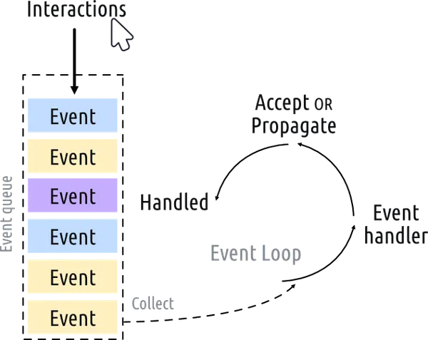

# 使用Python和Qt5创建一个简单的Hello World!应用

在这个教程中，我们将学习如何使用PyQt在Python中创建桌面应用程序。首先，我们将创建一系列简单的窗口，以确保PyQt正常工作，并介绍一些基本概念。然后，我们将简要介绍事件循环以及它与Python中的GUI编程的关系。最后，我们将研究Qt的 $QMainWindow$，该窗口提供了一些有用的常见界面元素，如工具栏和菜单。这些将在后续的教程中更详细地探讨。

## 创建应用

让我们创建我们的第一个应用程序吧！首先，创建一个新的Python文件 —— 您可以随意命名它（例如，app.py），并将其保存在可以访问的地方。我们将在这个文件中编写我们的简单应用程序。

> 我们将随着教程的进行在这个文件中进行编辑，而且您可能希望返回到代码的早期版本，因此请记得定期备份。

以下是该应用程序的源代码。请逐字输入，并注意不要出错。如果出现错误，Python会提示您出了什么问题。

```python
from PyQt5.QtWidgets import QApplication, QWidget

# Only needed for access to command line arguments
import sys

# You need one (and only one) QApplication instance per application.
# Pass in sys.argv to allow command line arguments for your app.
# If you know you won't use command line arguments QApplication([]) works too.
app = QApplication(sys.argv)

# Create a Qt widget, which will be our window.
window = QWidget()
window.show()  # IMPORTANT!!!!! Windows are hidden by default.

# Start the event loop.
app.exec()


# Your application won't reach here until you exit and the event
# loop has stopped.

```

首先，启动您的应用程序。您可以像运行其他Python脚本一样，通过命令行来运行它，例如 —

```python
python3 app.py
```

> 运行它！您现在将看到您的窗口。Qt会自动创建一个带有常规窗口装饰的窗口，您可以像任何窗口一样拖动它并调整大小。

您将看到的效果将取决于您在哪个平台上运行此示例。下面的图片显示了在Windows、macOS和Linux（Ubuntu）上显示的窗口。


## 逐步分析代码

让我们逐行分析代码，确切了解正在发生的事情。

首先，我们导入应用程序所需的PyQt类。在这里，我们从 $QtWidgets$ 模块导入了 $QApplication$ （应用程序处理程序）和$QWidget$（一个基本的空GUI小部件）。

```python
from PyQt5.QtWidgets import QApplication, QWidget
```

主要的Qt模块包括$QtWidgets$、$QtGui$和$QtCore$。

> 您可以使用 `from <module> import *` 这种全局导入，但在Python中，这种全局导入通常被视为不佳的实践，因此我们在这里避免使用它。

接下来，我们创建了一个$QApplication$的实例，传递了 `sys.argv`，这是一个包含传递给应用程序的命令行参数的Python列表。

```python
app = QApplication(sys.argv)
```

如果您知道不会使用命令行参数来控制Qt，您可以传递一个空列表，例如：

```python
app = QApplication([])
```

接下来，我们使用变量名 `window`创建了一个$QWidget$的实例。

```python
window = QWidget()
window.show()
```

在Qt中，所有的顶层小部件都是窗口 —— 也就是说，它们没有父级，并且不嵌套在另一个小部件或布局中。这意味着您实际上可以使用任何您喜欢的小部件来创建一个窗口。

> 没有父级的小部件默认是不可见的。因此，在创建窗口对象之后，我们必须始终调用 `.show()` 使其可见。您可以删除 `.show()` 并运行应用程序，但将无法退出它！

> 什么是窗口？
>
> - 包含应用程序的用户界面
> - 每个应用程序至少需要一个窗口（但可以有更多）
> - 当最后一个窗口关闭时，默认情况下应用程序将退出

最后，我们调用 `app.exec()` 启动事件循环。

> 在PyQt5中，您也可以使用 `app.exec_()`。这是一个遗留特性，以避免与Python 2中的 `exec` 保留字发生冲突。

## 什么是事件循环

在将窗口显示在屏幕上之前，有一些关键概念需要介绍，这涉及到Qt世界中如何组织应用程序的方式。如果您已经熟悉事件循环，可以安全地跳到下一节。

每个Qt应用程序的核心是 `QApplication` 类。每个应用程序都需要一个 —— 且仅有一个 —— `QApplication`对象来运行。这个对象持有您应用程序的事件循环 —— 控制与GUI的所有用户交互的核心循环。



与您的应用程序的每次交互 —— 无论是按键、鼠标点击还是鼠标移动 —— 都会生成一个事件，该事件被放置在事件队列中。在事件循环中，队列在每次迭代时都会被检查，如果发现等待的事件，将事件和控制传递给该事件的特定事件处理程序。事件处理程序处理事件，然后将控制传递回事件循环，等待更多事件。每个应用程序只有一个正在运行的事件循环。

> `QApplication`类： 
>
> * `QApplication`持有Qt事件循环
> * 每个应用程序需要一个 `QApplication`实例
> * 您的应用程序在事件循环中等待，直到采取某个操作
> * 任何时候只能运行一个事件循环


# `QMainWindow`

正如我们在上一部分中了解到的，Qt中任何小部件都可以是窗口。例如，如果将 `QtWidget`替换为 `QPushButton`。在下面的例子中，您将得到一个包含一个可按的按钮的窗口。

```python
import sys
from PyQt5.QtWidgets import QApplication, QPushButton

app = QApplication(sys.argv)

window = QPushButton("Push Me")
window.show()

app.exec()
```

这很简单，但实际上并不是很有用 —— 很少有需要仅包含单个控件的UI！但是，正如我们将在后面发现的那样，使用布局将小部件嵌套在其他小部件中的能力意味着您可以在空的QWidget内构建复杂的UI。

但是，Qt已经为您提供了一个解决方案 —— `QMainWindow`。这是一个预制小部件，提供了许多标准窗口功能，您可以在应用程序中使用这些功能，包括工具栏、菜单、状态栏、可停靠的小部件等等。我们将在后面查看这些高级功能，但现在，我们将在应用程序中添加一个简单的空 `QMainWindow`。

```python
import sys
from PyQt5.QtWidgets import QApplication, QMainWindow

app = QApplication(sys.argv)

window = QMainWindow()
window.show()

# 启动事件循环
app.exec()
```

> 运行它！您现在将看到您的主窗口。它看起来与之前完全相同！

因此，目前我们的 `QMainWindow`并不是非常有趣。我们可以通过添加一些内容来解决这个问题。如果您想创建自定义窗口，最好的方法是子类化 `QMainWindow`，然后在 `__init__`块中包含窗口的设置。这样可以使窗口行为是自包含的。我们可以添加我们自己的 `QMainWindow`子类 —— 将其称为 `MainWindow`以保持简单。

```python
import sys

from PyQt5.QtCore import QSize, Qt
from PyQt5.QtWidgets import QApplication, QMainWindow, QPushButton


# 子类QMainWindow以自定义应用程序的主窗口
class MainWindow(QMainWindow):
    def __init__(self):
        super().__init__()

        self.setWindowTitle("My App")
        button = QPushButton("Press Me!")

        # 设置窗口的中央小部件。
        self.setCentralWidget(button)


app = QApplication(sys.argv)

window = MainWindow()
window.show()

app.exec()
```

在这个演示中，我们使用了一个 `QPushButton`。核心Qt小部件总是从 `QtWidgets`命名空间导入，`QMainWindow`和 `QApplication`类也是如此。在使用 `QMainWindow`时，我们使用 `.setCentralWidget`将小部件（这里是 `QPushButton`）放置在 `QMainWindow`中 —— 默认情况下，它占据整个窗口。我们将在布局教程中了解如何向窗口添加多个小部件。

> 当您子类化Qt类时，必须始终调用 `super.__init__`函数，以便Qt设置对象。

在我们的 `__init__`块中，我们首先使用 `.setWindowTitle()`更改主窗口的标题。然后，我们添加了我们的第一个小部件 —— 一个 `QPushButton`，放置在窗口的中央。这是Qt中可用的基本小部件之一。在创建按钮时，您可以传递要按钮显示的文本。

最后，我们在窗口上调用了 `.setCentralWidget()`。这是一个特定于 `QMainWindow`的函数，允许您设置放在窗口中央的小部件。

> 运行它！您现在将再次看到窗口，但这次在中央有一个 `QPushButton`小部件。按下按钮将不会有任何反应，我们将在接下来解决这个问题。


> 我们将很快详细介绍更多小部件，但如果您不耐烦并希望提前查看，可以查看QWidget文档。尝试向您的窗口添加不同的小部件！

# 调整窗口和小部件的大小

当前，窗口可以自由调整大小 —— 如果您用鼠标抓住任何角落，可以拖动并调整到任何大小。虽然让用户调整应用程序大小是一种好方法，但有时您可能希望对最小或最大大小进行限制，或将窗口锁定到固定大小。

在Qt中，使用 `QSize`对象定义大小。这个对象按照宽度和高度的顺序接受参数。例如，以下代码将创建一个固定大小为400x300像素的窗口。

```python
import sys

from PyQt5.QtCore import QSize, Qt
from PyQt5.QtWidgets import QApplication, QMainWindow, QPushButton

# 子类QMainWindow以自定义应用程序的主窗口
class MainWindow(QMainWindow):
    def __init__(self):
        super().__init__()

        self.setWindowTitle("My App")

        button = QPushButton("Press Me!")

        self.setFixedSize(QSize(400, 300))

        # 设置窗口的中央小部件。
        self.setCentralWidget(button)


app = QApplication(sys.argv)

window = MainWindow()
window.show()

app.exec()
```

> 运行它！您将看到一个固定大小的窗口 —— 尝试调整大小，它将无效。


在Windows和Linux上，`setFixedSize()` 方法被禁用。在macOS上，您可以将应用程序最大化以填充屏幕，但中央小部件不会调整大小。

除了使用 `.setFixedSize()`，您还可以使用 `.setMinimumSize()` 和 `.setMaximumSize()` 分别设置最小和最大大小。请尝试自己进行实验！

> 您可以在任何小部件上使用这些大小方法。

在本节中，我们介绍了 `QApplication`类、`QMainWindow`类、事件循环，并尝试将简单的小部件添加到窗口中。在下一节中，我们将查看Qt为小部件和窗口之间以及与您自己的代码进行通信提供的机制。
