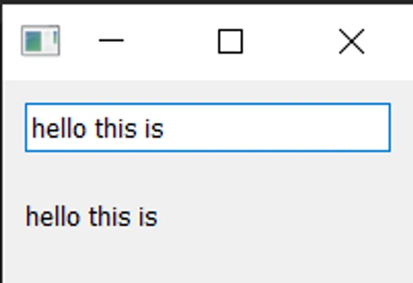

# 触发用户行为和GUI事件响应的操作

到目前为止，我们创建了一个窗口并向其添加了一个简单的按钮小部件，但是按钮什么都不做。这样一点用也没有 —— 当您创建GUI应用程序时，通常希望它们执行某些操作！我们需要的是一种将按钮按下的动作与某些操作连接起来的方法。在Qt中，这由信号和槽（Slots）或事件提供。

## **Signals & Slots（信号和槽）**

信号是小部件在发生某事时发出的通知。这个“某事”可以是任何事情，从按下按钮到输入框文本更改，再到窗口文本更改。许多信号由用户操作引发，但这不是一条规则。

除了通知某事发生外，信号还可以发送数据，以提供有关发生了什么的其他上下文。

> 您还可以创建自己的自定义信号，我们稍后会探讨。

槽是Qt用于接收信号的接收器的名称。在Python中，您应用程序中的任何函数（或方法）都可以用作槽 —— 只需将信号连接到它。如果信号发送数据，那么接收函数也将接收到这些数据。许多Qt小部件还具有其自己的内置槽，这意味着您可以直接将Qt小部件连接在一起。

让我们来看看Qt信号的基础知识，以及如何使用它们将小部件连接起来在应用程序中执行操作。

将以下应用程序概述保存到名为 `app.py`的文件中。

```python
import sys
from PyQt5.QtWidgets import QApplication, QMainWindow, QPushButton

class MainWindow(QMainWindow):

    def __init__(self):
        super().__init__()

        self.setWindowTitle("My App")


app = QApplication(sys.argv)

window = MainWindow()
window.show()

app.exec()
```

## `QPushButton` 信号

我们的简单应用程序当前具有一个 `QMainWindow`，其中包含一个设置为中央小部件的 `QPushButton`。让我们首先将此按钮连接到一个自定义的Python方法。在这里，我们创建了一个简单的自定义槽，名为 `the_button_was_clicked`，它接受来自 `QPushButton`的 `clicked`信号。

```python
import sys
from PyQt5.QtWidgets import QApplication, QMainWindow, QPushButton

class MainWindow(QMainWindow):
    def __init__(self):
        super().__init__()

        self.setWindowTitle("My App")

        button = QPushButton("Press Me!")
        button.setCheckable(True)
        button.clicked.connect(self.the_button_was_clicked)

        # 设置窗口的中央小部件。
        self.setCentralWidget(button)

    def the_button_was_clicked(self):
        print("Clicked!")

app = QApplication(sys.argv)

window = MainWindow()
window.show()

app.exec()
```

> 运行它！如果您点击按钮，您将在控制台上看到文本"Clicked!"。

```plaintext
Clicked!
Clicked!
Clicked!
Clicked!
```

## 接收数据

这是一个良好的开始！我们已经知道信号还可以发送数据，以提供有关刚刚发生的事情的更多信息。`.clicked` 信号也不例外，还提供了按钮的 checked（或切换）状态。对于普通按钮，这总是False，因此我们的第一个槽忽略了这个数据。但是，我们可以使我们的按钮可选中并看到效果。

在以下示例中，我们添加了第二个槽，用于输出检查状态。

```python
class MainWindow(QMainWindow):
    def __init__(self):
        super().__init__()

        self.setWindowTitle("My App")

        button = QPushButton("Press Me!")
        button.setCheckable(True)
        button.clicked.connect(self.the_button_was_clicked)
        button.clicked.connect(self.the_button_was_toggled)

        self.setCentralWidget(button)

    def the_button_was_clicked(self):
        print("Clicked!")

    def the_button_was_toggled(self, checked):
        print("Checked?", checked)
```

> 运行它！如果您按下按钮，您将看到它被突出显示为已选中状态。再次按下以释放它。在控制台中查找检查状态。

```plaintext
Clicked!
Checked? True
Clicked!
Checked? False
Clicked!
Checked? True
Clicked!
Checked? False
Clicked!
Checked? True
```

您可以将尽可能多的槽连接到一个信号，并且可以同时在槽上响应不同版本的信号。

## 存储数据

通常，将小部件的当前状态存储在Python变量中非常有用。这使您可以像处理任何其他Python变量一样使用这些值，而无需访问原始小部件。您可以将这些值存储为单独的变量，或者如果喜欢，可以使用字典。在下面的示例中，我们将按钮的已选中值存储在称为 `button_is_checked`的变量中。

```python
class MainWindow(QMainWindow):
    def __init__(self):
        super().__init__()

        self.button_is_checked = True

        self.setWindowTitle("My App")

        button = QPushButton("Press Me!")
        button.setCheckable(True)
        button.clicked.connect(self.the_button_was_toggled)
        button.setChecked(self.button_is_checked)

        self.setCentralWidget(button)

    def the_button_was_toggled(self, checked):
        self.button_is_checked = checked

        print(self.button_is_checked)
```

首先，我们为变量设置默认值（为True），然后使用默认值设置小部件的初始状态。当小部件状态更改时，我们接收到信号并更新变量以匹配。

您可以在任何PyQt小部件中使用相同的模式。如果小部件没有提供发送当前状态的信号，则您需要在处理程序中直接从小部件中检索值。例如，在此处，我们在按下处理程序中检查了已选中状态。

```python
class MainWindow(QMainWindow):
    def __init__(self):
        super().__init__()

        self.button_is_checked = True

        self.setWindowTitle("My App")

        self.button = QPushButton("Press Me!")
        self.button.setCheckable(True)
        self.button.released.connect(self.the_button_was_released)
        self.button.setChecked(self.button_is_checked)

        self.setCentralWidget(self.button)

    def the_button_was_released(self):
        self.button_is_checked = self.button.isChecked()

        print(self.button_is_checked)
```

> 我们需要在 `self`上保留对按钮的引用，以便在槽中访问它。

`released` 信号在按钮释放时触发，但不发送检查状态，因此我们使用 `.isChecked()` 在处理程序中从按钮获取检查状态。

## 更改界面

到目前为止，我们已经学会了如何接受信号并将输出打印到控制台。但是，当我们单击按钮时，如何在界面中触发某些操作呢？让我们更新我们的槽方法，修改按钮，更改文本并禁用按钮，使其无法再次点击。我们还将暂时关闭可检查状态。

```python
class MainWindow(QMainWindow):
    def __init__(self):
        super().__init__()

        self.setWindowTitle("My App")

        self.button = QPushButton("Press Me!")
        self.button.clicked.connect(self.the_button_was_clicked)

        self.setCentralWidget(self.button)

    def the_button_was_clicked(self):
        self.button.setText("You already clicked me.")
        self.button.setEnabled(False)

        # Also change the window title.
        self.setWindowTitle("My Oneshot App")
```

同样，因为我们需要在 `the_button_was_clicked` 方法中访问按钮，我们在 `self` 上保留了对它的引用。按钮的文本通过将字符串传递给 `.setText()` 来更改。要禁用按钮，请调用 `.setEnabled()` 并传入 `False`。

> 运行它！如果您点击按钮，文本将更改，并且按钮将变得不可点击。

您不仅限于更改触发信号的按钮，您可以在槽方法中执行任何您想要的操作。例如，尝试向 `the_button_was_clicked` 方法添加以下行，以更改窗口标题。

```python
self.setWindowTitle("A new window title")
```

大多数小部件都有它们自己的信号 —— 我们用于窗口的 `QMainWindow` 也不例外。在下面的更复杂的示例中，我们将 `QMainWindow` 上的 `.windowTitleChanged` 信号连接到一个自定义的槽方法。

在以下示例中，我们将 `QMainWindow` 上的 `.windowTitleChanged` 信号连接到一个名为 `the_window_title_changed` 的方法槽。此槽还接收新的窗口标题。

```python
from PyQt5.QtWidgets import QApplication, QMainWindow, QPushButton

import sys
from random import choice

window_titles = [
    'My App',
    'My App',
    'Still My App',
    'Still My App',
    'What on earth',
    'What on earth',
    'This is surprising',
    'This is surprising',
    'Something went wrong'
]

class MainWindow(QMainWindow):
    def __init__(self):
        super().__init__()

        self.n_times_clicked = 0

        self.setWindowTitle("My App")

        self.button = QPushButton("Press Me!")
        self.button.clicked.connect(self.the_button_was_clicked)

        self.windowTitleChanged.connect(self.the_window_title_changed)

        # Set the central widget of the Window.
        self.setCentralWidget(self.button)

    def the_button_was_clicked(self):
        print("Clicked.")
        new_window_title = choice(window_titles)
        print("Setting title:  %s" % new_window_title)
        self.setWindowTitle(new_window_title)

    def the_window_title_changed(self, window_title):
        print("Window title changed: %s" % window_title)

        if window_title == 'Something went wrong':
            self.button.setDisabled(True)

app = QApplication(sys.argv)

window = MainWindow()
window.show()

app.exec()
```

首先，我们设置了窗口标题的列表 —— 我们将使用 Python 内置的 `random.choice()` 从中随机选择一个。我们将自定义槽方法 `the_window_title_changed` 连接到窗口的 `.windowTitleChanged` 信号。

当单击按钮时，窗口标题将随机更改。如果新窗口标题等于 "Something went wrong"，则按钮将被禁用。

> 运行它！重复点击按钮，直到标题更改为 "Something went wrong"，按钮将变为禁用状态。

在这个示例中有几件事情需要注意。

首先，当设置窗口标题时，`windowTitleChanged` 信号并不总是发射。该信号仅在新标题与先前标题不同时触发。如果多次设置相同的标题，则该信号仅在第一次触发。仔细检查信号触发的条件是很重要的，以避免在应用程序中使用它们时感到惊讶。

其次，请注意我们如何能够使用信号将事物连接在一起。一个事件发生 —— 按钮按下 —— 可以触发多个其他事物依次发生。这些后续效果无需知道是什么导致它们，而只是遵循简单规则的结果。在构建GUI应用程序时，理解效果与其触发器之间的解耦是需要理解的关键概念之一。在本书中我们将一直回到这一点！

在本节中，我们介绍了信号和槽。我们演示了一些简单的信号以及如何使用它们在应用程序中传递数据和状态。接下来，我们将查看Qt为应用程序提供的小部件以及它们提供的信号。

## 将小部件直接连接在一起

到目前为止，我们已经看到了将小部件的信号连接到Python方法的例子。当从小部件触发信号时，将调用我们的Python方法，并将数据从信号传递给它。但您并不总是需要使用Python函数来处理信号 —— 您还可以直接将Qt小部件连接到彼此。

在下面的示例中，我们向窗口添加了一个QLineEdit小部件和一个QLabel。在窗口的 \_\___init____ 中，我们将我们的LineEdit的 .textChanged 信号连接到QLabel的 .setText 方法。现在，每当QLineEdit中的文本更改时，QLabel将接收到该文本并传递给它的 .setText 方法。

```python
from PyQt5.QtWidgets import QApplication, QMainWindow, QLabel, QLineEdit, QVBoxLayout, QWidget

import sys

class MainWindow(QMainWindow):
    def __init__(self):
        super().__init__()

        self.setWindowTitle("My App")

        self.label = QLabel()

        self.input = QLineEdit()
        self.input.textChanged.connect(self.label.setText)

        layout = QVBoxLayout()
        layout.addWidget(self.input)
        layout.addWidget(self.label)

        container = QWidget()
        container.setLayout(layout)

        # Set the central widget of the Window.
        self.setCentralWidget(container)

app = QApplication(sys.argv)

window = MainWindow()
window.show()

app.exec()
```

请注意，为了将输入连接到标签，必须同时定义输入和标签。此代码将两个小部件添加到布局中，并将其设置在窗口上。我们将在后面详细介绍布局，现在您可以忽略它。

> 运行它！在上方框中输入一些文本，您将立即在标签上看到它。




大多数Qt小部件都有可用的槽，您可以将任何发出与其接受的相同类型的信号连接到这些槽。小部件文档中列出了每个小部件的槽，可以在“Public Slots”下找到。例如，请参阅[QLabel的文档](https://doc.qt.io/qt-5/qlabel.html#public-slots)。

## 事件

用户与Qt应用程序的每次交互都是一个事件。有许多类型的事件，每个事件代表一种不同类型的交互。Qt使用事件对象表示这些事件，这些事件对象打包了关于发生了什么的信息。这些事件传递给发生交互的小部件上的特定事件处理程序。

通过定义自定义或扩展的事件处理程序，您可以改变小部件对这些事件的响应方式。事件处理程序的定义方式与任何其他方法相同，但名称是特定于其处理的事件类型的。

小部件接收的主要事件之一是 `QMouseEvent`。为小部件上的每次鼠标移动和按键单击创建QMouseEvent事件。以下事件处理程序可用于处理鼠标事件 -

| 事件处理器            | 移动类型     |
| --------------------- | ------------ |
| mouseMoveEvent        | 鼠标移动     |
| mousePressEvent       | 鼠标按钮按下 |
| mouseReleaseEvent     | 鼠标按钮释放 |
| mouseDoubleClickEvent | 检测到双击   |

例如，单击小部件将导致将QMouseEvent发送到该小部件上的.mousePressEvent事件处理程序。此处理程序可以使用事件对象获取有关发生了什么的信息，例如触发事件的原因以及具体发生的位置。

您可以通过对类进行子类化并覆盖类上的处理程序方法来拦截事件。您可以选择过滤、修改或忽略事件，并通过调用父类函数使用super()将它们传递给事件的正常处理程序。这些可以添加到主窗口类中，如下所示。在每种情况下，e将接收传入的事件。

```python
import sys
from PyQt5.QtCore import Qt
from PyQt5.QtWidgets import QApplication, QLabel, QMainWindow, QTextEdit

class MainWindow(QMainWindow):
    def __init__(self):
        super().__init__()
        self.label = QLabel("Click in this window")
        self.setCentralWidget(self.label)

    def mouseMoveEvent(self, e):
        self.label.setText("mouseMoveEvent")

    def mousePressEvent(self, e):
        self.label.setText("mousePressEvent")

    def mouseReleaseEvent(self, e):
        self.label.setText("mouseReleaseEvent")

    def mouseDoubleClickEvent(self, e):
        self.label.setText("mouseDoubleClickEvent")

app = QApplication(sys.argv)
window = MainWindow()
window.show()
app.exec()
```

> 运行它！尝试在窗口中移动和点击（以及双击），观察事件的出现。

您会注意到只有在按下按钮时才会注册鼠标移动事件。您可以通过在窗口上调用 `self.setMouseTracking(True)`来更改此行为。您还可能注意到，当按下按钮时，按下（点击）和双击事件都会触发。只有释放按钮时才会触发释放事件。通常，要注册用户的点击，您应该同时观察鼠标按下和释放。在事件处理程序内部，您可以访问事件对象。此对象包含有关事件的信息，并且可以根据发生了什么来以不同的方式做出响应。接下来我们将看一下鼠标事件对象。


所有Qt中的鼠标事件都使用 `QMouseEvent`对象进行跟踪，有关事件的信息可从以下事件方法中读取。

| Method       | Returns                                 |
| ------------ | --------------------------------------- |
| .button()    | 触发时间的指定按钮                      |
| .buttons()   | 所有鼠标按键的状态(OR'ed flags)         |
| .globalPos() | `QPoint`类型，应用全局，坐标          |
| .globalX()   | 应用全局，水平坐标 `X`                |
| .globalY()   | 应用全局，垂直坐标 `Y`                |
| .pos()       | 相对于Widget的 `QPoint` 整数坐标      |
| .posF()      | 相对于Widget的 `QPointF` *浮点坐标* |

您可以在事件处理程序中使用这些方法以不同的方式对不同的事件做出响应，或完全忽略它们。位置方法提供了作为 `QPoint`对象的全局和本地（相对于小部件的）位置信息，而使用来自 `Qt`命名空间的鼠标按钮类型报告按钮。

例如，以下允许我们对窗口上的左键、右键或中键点击做出不同的响应。

```python
def mousePressEvent(self, e):
    if e.button() == Qt.LeftButton:
        # 在这里处理左键按下
        self.label.setText("mousePressEvent LEFT")

    elif e.button() == Qt.MiddleButton:
        # 在这里处理中键按下
        self.label.setText("mousePressEvent MIDDLE")

    elif e.button() == Qt.RightButton:
        # 在这里处理右键按下
        self.label.setText("mousePressEvent RIGHT")

def mouseReleaseEvent(self, e):
    if e.button() == Qt.LeftButton:
        self.label.setText("mouseReleaseEvent LEFT")

    elif e.button() == Qt.MiddleButton:
        self.label.setText("mouseReleaseEvent MIDDLE")

    elif e.button() == Qt.RightButton:
        self.label.setText("mouseReleaseEvent RIGHT")

def mouseDoubleClickEvent(self, e):
    if e.button() == Qt.LeftButton:
        self.label.setText("mouseDoubleClickEvent LEFT")

    elif e.button() == Qt.MiddleButton:
        self.label.setText("mouseDoubleClickEvent MIDDLE")

    elif e.button() == Qt.RightButton:
        self.label.setText("mouseDoubleClickEvent RIGHT")
```

按钮标识符在Qt命名空间中定义，如下所示。

| Identifier      | Value (binary) | Represents                   |
| --------------- | -------------- | ---------------------------- |
| Qt.NoButton     | 0 (000)        | 无按钮按下，或事件不关联按钮 |
| Qt.LeftButton   | 1 (001)        | 按下左键                     |
| Qt.RightButton  | 2 (010)        | 按下右键                     |
| Qt.MiddleButton | 4 (100)        | 按下中键                     |

> 在左撇子鼠标上，左右按钮位置是颠倒的，即按下最右边的按钮将返回 `Qt.LeftButton`。这意味着您不需要在代码中考虑鼠标的方向。

## **上下文菜单**

上下文菜单是小型的上下文敏感菜单，通常在右键单击窗口时出现。Qt支持生成这些菜单，而小部件有一个特定的事件用于触发它们。在以下示例中，我们将拦截 `QMainWindow`上的 `.contextMenuEvent`。每当要显示上下文菜单时，将触发此事件，并传递一个类型为 `QContextMenuEvent`的事件对象。

为了拦截事件，我们只需重写具有相同名称的对象方法。因此，在这种情况下，我们可以在 `MainWindow`子类上创建一个名为 `contextMenuEvent`的方法，它将接收所有此类型的事件。

```python
import sys
from PyQt5.QtCore import Qt
from PyQt5.QtWidgets import QAction, QApplication, QLabel, QMainWindow, QMenu

class MainWindow(QMainWindow):
    def __init__(self):
        super().__init__()

    def contextMenuEvent(self, e):
        context = QMenu(self)
        context.addAction(QAction("test 1", self))
        context.addAction(QAction("test 2", self))
        context.addAction(QAction("test 3", self))
        context.exec(e.globalPos())

app = QApplication(sys.argv)
window = MainWindow()
window.show()
app.exec()
```

如果运行上述代码并在窗口内右键单击，您将看到一个上下文菜单。您可以像往常一样在菜单动作上设置 `.triggered`槽（并重用为菜单和工具栏定义的动作）。

> 在将初始位置传递给 `exec`函数时，这必须相对于在定义时传递的父级。在这种情况下，我们将 `self`作为父级传递，因此我们可以使用全局位置。

只是为了完整起见，实际上还有一种基于信号的创建上下文菜单的方法。

```python
class MainWindow(QMainWindow):
    def __init__(self):
        super().__init__()
        self.show()

        self.setContextMenuPolicy(Qt.CustomContextMenu)
        self.customContextMenuRequested.connect(self.on_context_menu)

    def on_context_menu(self, pos):
        context = QMenu(self)
        context.addAction(QAction("test 1", self))
        context.addAction(QAction("test 2", self))
        context.addAction(QAction("test 3", self))
        context.exec(self.mapToGlobal(pos))
```

您可以自行选择使用哪种方法。

## **事件层次结构**

在PyQt中，每个小部件都是两个不同层次结构的一部分：Python对象层次结构和Qt布局层次结构。您如何响应或忽略事件会影响UI的行为方式。

## **Python继承转发**

通常，您可能希望拦截事件，对其进行一些操作，然后仍然触发默认的事件处理行为。如果您的对象是从标准小部件继承而来，它可能已经默认实现了明智的行为。您可以通过使用 `super()`调用上层实现来触发这一点。

> 这是Python的父类，而不是PyQt的 `.parent()`。

```python
def mousePressEvent(self, event):
    print("Mouse pressed!")
    super().contextMenuEvent(event)
```

事件将继续以正常方式运行，但是您已经添加了一些不干扰的行为。

## **布局转发(传递)**

当您将小部件添加到应用程序时，它还会从布局中获取另一个父级。小部件的父级可以通过调用 `.parent()`来找到。有时您手动指定这些父级，例如对于 `QMenu`或 `QDialog`，通常是自动的。例如，当您将小部件添加到主窗口时，主窗口将成为小部件的父级。

当为用户与UI交互创建事件时，这些事件会传递给UI中的最上层小部件。因此，如果在窗口上有一个按钮，并单击按钮，那么首先按钮将接收事件。

如果第一个小部件无法处理事件，或选择不处理事件，事件将冒泡到父小部件，该父小部件将获得处理的机会。此冒泡一直继续到嵌套小部件的最上层，直到事件被处理或达到主窗口。

在您自己的事件处理程序中，您可以选择将事件标记为已处理，调用 `.accept()` —

```python
class CustomButton(QPushButton)
    def mousePressEvent(self, e):
        e.accept()
```

或者，您可以通过在事件对象上调用 `.ignore()`来将其标记为未处理。在这种情况下，事件将继续冒泡到层次结构中。

```python
class CustomButton(QPushButton)
    def event(self, e):
        e.ignore()
```

如果您希望您的小部件对事件保持透明，可以安全地忽略您实际上已经以某种方式响应的事件。同样，您可以选择接受您不响应的事件以将其消音。
