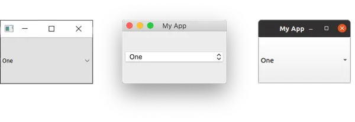

# 使用QPushButton, QCheckBox, QComboBox, QLabel and QSlider widgets

在Qt中，与大多数GUI框架一样，小部件是指用户可以与之交互的UI组件的名称。用户界面由多个小部件组成，排列在窗口内。

Qt提供了许多可用的小部件，甚至允许您创建自己的自定义和定制小部件。在本教程中，您将学习Qt GUI应用程序中一些最常用小部件的基础知识。

**目录**

- 快速小部件演示
- QLabel
- QCheckBox
- QComboBox
- QListWidget
- QLineEdit
- QSpinBox和QDoubleSpinBox
- QSlider
- QDial
- 结论

## 快速小部件演示

首先，让我们看一下一些最常见的PyQt小部件。以下代码创建了一系列PyQt小部件，并将它们添加到窗口布局中，以便您可以一起查看它们：

```python
import sys

from PyQt5.QtWidgets import (
    QApplication,
    QCheckBox,
    QComboBox,
    QDateEdit,
    QDateTimeEdit,
    QDial,
    QDoubleSpinBox,
    QFontComboBox,
    QLabel,
    QLCDNumber,
    QLineEdit,
    QMainWindow,
    QProgressBar,
    QPushButton,
    QRadioButton,
    QSlider,
    QSpinBox,
    QTimeEdit,
    QVBoxLayout,
    QWidget,
)

# 通过继承QMainWindow来自定义应用程序的主窗口
class MainWindow(QMainWindow):
    def __init__(self):
        super().__init__()

        self.setWindowTitle("Widgets App")

        layout = QVBoxLayout()
        widgets = [
            QCheckBox,
            QComboBox,
            QDateEdit,
            QDateTimeEdit,
            QDial,
            QDoubleSpinBox,
            QFontComboBox,
            QLCDNumber,
            QLabel,
            QLineEdit,
            QProgressBar,
            QPushButton,
            QRadioButton,
            QSlider,
            QSpinBox,
            QTimeEdit,
        ]

        for w in widgets:
            layout.addWidget(w())

        widget = QWidget()
        widget.setLayout(layout)

        # 设置窗口的中央小部件。小部件将默认扩展以占据窗口中的所有空间。
        self.setCentralWidget(widget)

app = QApplication(sys.argv)
window = MainWindow()
window.show()
app.exec_()
```

> 运行它！您将看到一个窗口，其中包含我们创建的所有小部件。


> 我们将在下一个教程中介绍Qt中布局的工作原理。

让我们从上到下查看所有示例小部件：

| 小部件         | 功能                   |
| -------------- | ---------------------- |
| QCheckbox      | 复选框                 |
| QComboBox      | 下拉列表框             |
| QDateEdit      | 用于编辑日期和日期时间 |
| QDateTimeEdit  | 用于编辑日期和日期时间 |
| QDial          | 可旋转的刻度盘         |
| QDoubleSpinbox | 用于浮点数的数字微调器 |
| QFontComboBox  | 字体列表               |
| QLCDNumber     | 相当丑陋的LCD显示      |
| QLabel         | 仅用于标签，不可交互   |
| QLineEdit      | 输入一行文本           |
| QProgressBar   | 进度条                 |
| QPushButton    | 按钮                   |
| QRadioButton   | 切换集，只有一个活动项 |
| QSlider        | 滑块                   |
| QSpinBox       | 整数微调器             |
| QTimeEdit      | 用于编辑时间           |

除了这些，还有更多的小部件，但它们不太容易展示！您可以通过查阅Qt文档来了解所有小部件。

接下来，我们将逐步介绍一些最常用的小部件，并详细了解它们。要尝试这些小部件，我们需要一个简单的应用程序将它们放在其中。将以下代码保存到名为 `app.py`的文件中并运行它以确保它正常工作：

```python
import sys
from PyQt5.QtCore import Qt
from PyQt5.QtGui import QPixmap
from PyQt5.QtWidgets import (
    QApplication,
    QCheckBox,
    QComboBox,
    QDoubleSpinBox,
    QLabel,
    QLineEdit,
    QListWidget,
    QMainWindow,
    QSlider,
    QSpinBox,
)

class MainWindow(QMainWindow):
    def __init__(self):
        super(MainWindow, self).__init__()

        self.setWindowTitle("My App")

app = QApplication(sys.argv)
window = MainWindow()
window.show()
app.exec()
```

在上面的代码中，我们导入了一些Qt小部件。现在，我们将逐个介绍这些小部件，将它们添加到我们的应用程序中，并查看它们的行为。

### QLabel

我们将从QLabel开始介绍，可以说是Qt工具箱中最简单的小部件之一。这是一个简单的单行文本，您可以在应用程序中定位它。您可以通过在创建时传递字符串来设置文本：

```python
widget = QLabel("Hello")
```

您还可以通过使用 `setText()`方法动态设置标签的文本：

```python
widget = QLabel("1")  # 创建带有文本1的标签。
widget.setText("2")   # 现在标签显示2。
```

您还可以调整字体参数，例如字体的大小或小部件中文本的对齐方式：

```python
class MainWindow(QMainWindow):
    def __init__(self):
        super(MainWindow, self).__init__()

        self.setWindowTitle("My App")

        label = QLabel("Hello")
        font = label.font()
        font.setPointSize(30)
        label.setFont(font)
        label.setAlignment(Qt.AlignHCenter | Qt.AlignVCenter)

        self.setCentralWidget(label)
```

在上面的代码中，我们创建了一个带有文本“Hello”的标签，并调整了其字体大小和文本在小部件中的对齐方式。


> Font tip: 请注意，如果要更改小部件字体的属性，通常最好获取当前字体，更新字体，然后将其应用回去。这可以确保字体的样式保持与桌面约定一致。

对齐方式由Qt命名空间中的标志指定。以下表格列出了用于水平对齐的可用标志：

| 标志            | 行为                   |
| --------------- | ---------------------- |
| Qt.AlignLeft    | 与左边缘对齐。         |
| Qt.AlignRight   | 与右边缘对齐。         |
| Qt.AlignHCenter | 在可用空间中水平居中。 |
| Qt.AlignJustify | 在可用空间中对齐文本。 |

同样，可用于垂直对齐的标志有：

| 标志            | 行为                   |
| --------------- | ---------------------- |
| Qt.AlignTop     | 与顶部对齐。           |
| Qt.AlignBottom  | 与底部对齐。           |
| Qt.AlignVCenter | 在可用空间中垂直居中。 |

您可以使用竖线（|）将标志组合在一起。但是，请注意，您一次只能使用垂直或水平对齐标志：

```python
align_top_left = Qt.AlignLeft | Qt.AlignTop
```

> 请注意，您使用OR竖线（|）将两个标志组合在一起（而不是A＆B）。这是因为这些标志是不重叠的位掩码。例如，Qt.AlignmentFlag.AlignLeft的十六进制值为0x0001，而Qt.AlignmentFlag.AlignBottom为0x0040。通过将它们OR在一起，我们得到值0x0041，表示“左下”。这个原理适用于所有其他组合Qt标志。如果这对您来说是无稽之谈，请随意忽略它并继续前进。只需记住使用竖线（|）符号。

最后，还有一个同时在两个方向上居中的速记标志：

| 标志           | 行为                     |
| -------------- | ------------------------ |
| Qt.AlignCenter | 在水平和垂直方向上居中。 |

奇怪的是，您还可以使用 `QLabel`显示图像，使用 `setPixmap()`。这需要一个*pixmap*，您可以通过将图像文件名传递给 `QPixmap`类来创建。在本书提供的示例文件中，您可以找到一个名为 `otje.jpg`的文件，可以按照以下方式在窗口中显示它：

```python
widget.setPixmap(QPixmap('otje.jpg'))
```


多么可爱的面孔。默认情况下，图像会按比例缩放。如果您希望它拉伸并缩放以完全适应窗口，那么您可以在QLabel对象上调用setScaledContents(True)：

```python
widget.setScaledContents(True)
```

这样，您的图像将会拉伸并缩放以完全适应窗口。

### QCheckBox

接下来要看的是 QCheckBox()，顾名思义，它向用户提供了一个可勾选的框。然而，与所有 Qt 小部件一样，有许多可配置的选项来更改小部件的默认行为：

```python
class MainWindow(QMainWindow):
    def __init__(self):
        super(MainWindow, self).__init__()

        self.setWindowTitle("My App")

        widget = QCheckBox()
        widget.setCheckState(Qt.Checked)

        # 对于三态：widget.setCheckState(Qt.PartiallyChecked)
        # 或：widget.setTriState(True)
        widget.stateChanged.connect(self.show_state)

        self.setCentralWidget(widget)

    def show_state(self, s):
        print(s == Qt.Checked)
        print(s)
```


您可以使用 setChecked() 或 setCheckState() 方法以编程方式设置复选框状态。前者接受 True 或 False，分别对应选中或未选中状态。但是，对于 setCheckState()，您还可以使用 Qt 命名空间标志指定特定的选中状态：

| 标志 | 行为 |
| ---- | ---- |
|`Qt.Unchecked`|项目未选中|
|`Qt.PartiallyChecked`|项目部分选中|
|`Qt.Checked`|项目已选中|

支持部分选中状态（Qt.PartiallyChecked）的复选框通常称为“三态”，即既非开也非关。这种状态下的复选框通常显示为灰色复选框，并且通常用于具有层次结构的复选框布局，其中子项目与父复选框相连。

如果将值设置为 Qt.PartiallyChecked，则复选框将变为三态。您还可以使用 setTriState(True) 将复选框设置为三态，而无需将当前状态设置为部分选中。

在运行脚本时，您可能会注意到当前状态的数字显示为一个整数，其中 `checked = 2`，`unchecked = 0`，`partially checked = 1`。您不需要记住这些值，例如，`state == Qt.Checked` 中的 `Qt.Checked` 命名空间变量的值为 2。这是这些状态的相应标志的值。这意味着您可以使用 `state == Qt.Checked` 来测试状态。

### QComboBox

QComboBox 是一个下拉列表，默认情况下关闭，并带有一个箭头以打开它。您可以从列表中选择单个项目，当前选择的项目将显示为小部件上的标签。组合框适用于从一长串选项中进行选择。

> 您可能已经在文字处理应用程序中看到组合框用于选择字体或大小。尽管 Qt 实际上提供了一个专门的字体选择组合框 QFontComboBox。

您可以通过将字符串列表传递给 `addItems()` 来将项目添加到 `QComboBox`。项目将按提供的顺序添加：

```python
class MainWindow(QMainWindow):
    def __init__(self):
        super(MainWindow, self).__init__()

        self.setWindowTitle("My App")

        widget = QComboBox()
        widget.addItems(["One", "Two", "Three"])

        # 发送当前选择的项目的索引（位置）。
        widget.currentIndexChanged.connect(self.index_changed)

        # 还有一个发送文本的替代信号。
        widget.currentTextChanged.connect(self.text_changed)

        self.setCentralWidget(widget)

    def index_changed(self, i):  # i 是一个整数
        print(i)

    def text_changed(self, s):  # s 是一个字符串
        print(s)
```



`currentIndexChanged` 信号在当前选定的项目更新时触发，默认传递列表中选定项目的索引。还有一个 currentTextChanged 信号，它提供当前选定项目的标签，通常更有用。

`QComboBox` 也可以是可编辑的，允许用户输入当前列表中没有的值，并将其插入或简单地用作值。要使框可编辑，请使用 `setEditable()` 方法：

```python
widget.setEditable(True)
```

您还可以设置一个标志以确定如何处理插入。这些标志存储在 QComboBox 类本身上，并列在下面：
|标志|行为|
| - | - |
|QComboBox.NoInsert |执行不插入。|
|QComboBox.InsertAtTop |作为第一项插入。|
|QComboBox.InsertAtCurrent |替换当前选定的项目。|
|QComboBox.InsertAtBottom |在最后一项之后插入。|
|QComboBox.InsertAfterCurrent |在当前项目之后插入。|
|QComboBox.InsertBeforeCurrent |在当前项目之前插入。|
|QComboBox.InsertAlphabetically |按字母顺序插入。|

要使用这些标志，请如下应用标志：

```python
widget.setInsertPolicy(QComboBox.InsertAlphabetically)
```

您还可以使用 `setMaxCount()` 方法限制框中允许的项目数：

```python
widget.setMaxCount(10)
```

有关更深入地了解 `QComboBox`，请查看我们的 [`QComboBox`](https://www.pythonguis.com/docs/qcombobox/) 文档。

### QListWidget

这个小部件类似于 QComboBox，不同之处在于选项呈现为可滚动的项目列表。它还支持一次选择多个项目。QListWidget 提供 currentItemChanged 信号，发送 QListWidgetItem（列表窗口小部件的元素），以及 currentTextChanged 信号，发送当前项目的文本：

```python
class MainWindow(QMainWindow):

    def __init__(self):
        super(MainWindow, self).__init__()

        self.setWindowTitle("My App")

        widget = QListWidget()
        widget.addItems(["One", "Two", "Three"])

        widget.currentItemChanged.connect(self.index_changed)
        widget.currentTextChanged.connect(self.text_changed)

        self.setCentralWidget(widget)

    def index_changed(self, i): # 不是索引，i 是 QListWidgetItem
        print(i.text())

    def text_changed(self, s): # s 是一个字符串
        print(s)
```


### QLineEdit

QLineEdit 小部件是一个单行文本编辑框，用户可以在其中输入文本。这些用于表单字段或设置，其中没有受限制的有效输入列表。例如，在输入电子邮件地址或计算机名称时：

```python
class MainWindow(QMainWindow):

    def __init__(self):
        super(MainWindow, self).__init__()

        self.setWindowTitle("My App")

        widget = QLineEdit()
        widget.setMaxLength(10)
        widget.setPlaceholderText("Enter your text")

        #widget.setReadOnly(True) # uncomment this to make it read-only

        widget.returnPressed.connect(self.return_pressed)
        widget.selectionChanged.connect(self.selection_changed)
        widget.textChanged.connect(self.text_changed)
        widget.textEdited.connect(self.text_edited)

        self.setCentralWidget(widget)

    def return_pressed(self):
        print("Return pressed!")
        self.centralWidget().setText("BOOM!")

    def selection_changed(self):
        print("Selection changed")
        print(self.centralWidget().selectedText())

    def text_changed(self, s):
        print("Text changed...")
        print(s)

    def text_edited(self, s):
        print("Text edited...")
        print(s)
```


如上代码所示，您可以使用 `setMaxLength()` 方法为行编辑中的文本设置最大长度。

QLineEdit 具有许多可用于不同编辑事件的信号，包括当用户按下 Enter 键时，并且当用户选择更改时。还有两个编辑信号，一个用于在框中的文本已编辑，一个用于在其更改时。在这里的区别在于用户编辑和程序更改之间。只有在用户编辑文本时，才会发送 textEdited 信号。

此外，可以使用输入掩码执行输入验证，以定义支持哪些字符以及在哪里支持这些字符。这可以如下应用于字段：

```python
widget.setInputMask('000.000.000.000;_')
```

上面的示例允许一系列以句点分隔的3位数字，因此可用于验证 IPv4 地址。

### QSpinBox 和 QDoubleSpinBox

QSpinBox 提供了一个带有增加和减少值的箭头的小型数字输入框。QSpinBox 支持整数，而相关的小部件 QDoubleSpinBox 则支持浮点数：

```python
class MainWindow(QMainWindow):
    def __init__(self):
        super().__init__()

        self.setWindowTitle("My App")

        widget = QSpinBox()
        # Or: widget = QDoubleSpinBox()

        widget.setMinimum(-10)
        widget.setMaximum(3)
        # Or: widget.setRange(-10,3)

        widget.setPrefix("$")
        widget.setSuffix("c")
        widget.setSingleStep(3)  # Or e.g. 0.5 for QDoubleSpinBox
        widget.valueChanged.connect(self.value_changed)
        widget.textChanged.connect(self.value_changed_str)

        self.setCentralWidget(widget)

    def value_changed(self, i):
        print(i)

    def value_changed_str(self, s):
        print(s)
```

运行它，你将看到一个数字输入框。该值显示前缀和后缀单位，并被限制在范围 3 到 -10。


上面的演示代码展示了该部件可用的各种功能。

要设置可接受值的范围，可以使用 setMinimum() 和 setMaximum() 方法。或者，使用 setRange() 同时设置两者。使用 setPrefix() 和 setSuffix() 方法可以向数字添加前缀和后缀，以进行值类型的注释（例如，用于货币标记或单位）。

单击部件上的上箭头和下箭头将按一定的数量增加或减少部件中的值，可以使用 setSingleStep() 方法设置此数量。请注意，这不影响部件可接受的值。

QSpinBox 和 QDoubleSpinBox 都有一个 valueChanged 信号，每当它们的值被更改时触发。raw valueChanged 信号发送数字值（int 或 float），而 textChanged 发送值作为字符串，包括前缀和后缀字符。

您还可以选择禁用旋钮框的文本输入，使其只能使用控件更改值。通过将其设置为只读来实现此设置。使用此设置，只能使用控件更改值：

```python
widget.lineEdit().setReadOnly(True)
```

此设置还具有禁用闪烁光标的副作用。

### QSlider

QSlider 提供了一个滑块小部件，其内部工作方式类似于 QDoubleSpinBox。与数值表示当前值的方式不同，滑块的位置表示滑块手柄沿小部件长度的位置。这在提供两个极端之间的调整时很有用，但不需要绝对精度。此类型小部件的最常见用例是音频播放中的音量控制。

还有一个 sliderMoved 信号，每当滑块移动位置时触发，以及一个 sliderPressed 信号，每当点击滑块时发射：

```python
class MainWindow(QMainWindow):
    def __init__(self):
        super().__init__()

        self.setWindowTitle("My App")

        widget = QSlider()

        widget.setMinimum(-10)
        widget.setMaximum(3)
        # Or: widget.setRange(-10,3)

        widget.setSingleStep(3)

        widget.valueChanged.connect(self.value_changed)
        widget.sliderMoved.connect(self.slider_position)
        widget.sliderPressed.connect(self.slider_pressed)
        widget.sliderReleased.connect(self.slider_released)

        self.setCentralWidget(widget)

    def value_changed(self, i):
        print(i)

    def slider_position(self, p):
        print("position", p)

    def slider_pressed(self):
        print("Pressed!")

    def slider_released(self):
        print("Released")
```

运行此代码，您将看到一个滑块小部件。拖动滑块以更改值：


您还可以通过在创建时提供方向来构建具有垂直或水平方向的滑块。方向标志在 Qt 命名空间中定义：

```python
widget = QSlider(Qt.Vertical)
# Or:
widget = QSlider(Qt.Horizontal)
```

### QDial

最后，QDial 小部件是一个可旋转的小部件，其工作方式类似于滑块，但外观上类似于模拟表盘。该小部件看起来不错，但从 UI 视角来看，它并不特别用户友好。但是，在音频应用中，表盘通常用作真实模拟表盘的表示：

```python
class MainWindow(QMainWindow):
    def __init__(self):
        super().__init__()

        self.setWindowTitle("My App")

        widget = QDial()
        widget.setRange(-10, 100)
        widget.setSingleStep(0.5)

        widget.valueChanged.connect(self.value_changed)
        widget.sliderMoved.connect(self.slider_position)
        widget.sliderPressed.connect(self.slider_pressed)
        widget.sliderReleased.connect(self.slider_released)

        self.setCentralWidget(widget)

    def value_changed(self, i):
        print(i)

    def slider_position(self, p):
        print("position", p)

    def slider_pressed(self):
        print("Pressed!")

    def slider_released(self):
        print("Released")
```

运行此代码，您将看到一个圆形表盘。旋转它以选择范围内的数字：


这些信号与 QSlider 小部件相同，并保持相同的名称（例如 sliderMoved）。

## 结论

这就结束了我们对在 PyQt 应用程序中常用小部件的简要介绍。要查看所有可用小部件的完整列表，包括它们的所有信号和属性，请查阅 Qt 文档。
