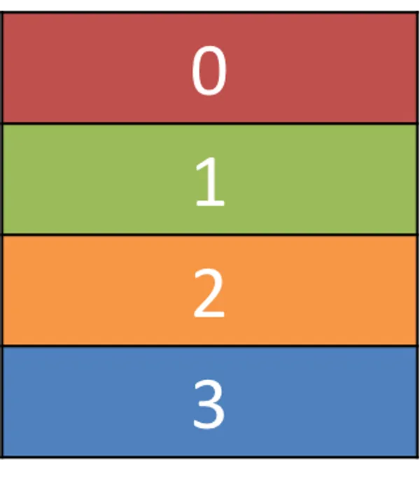
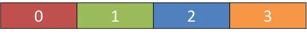
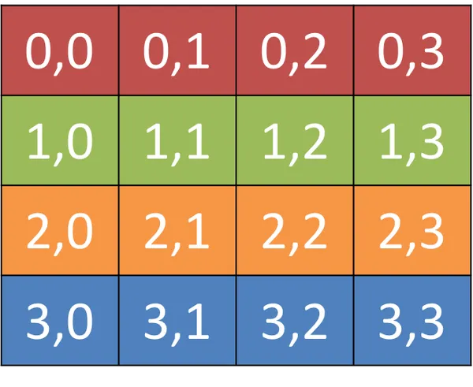
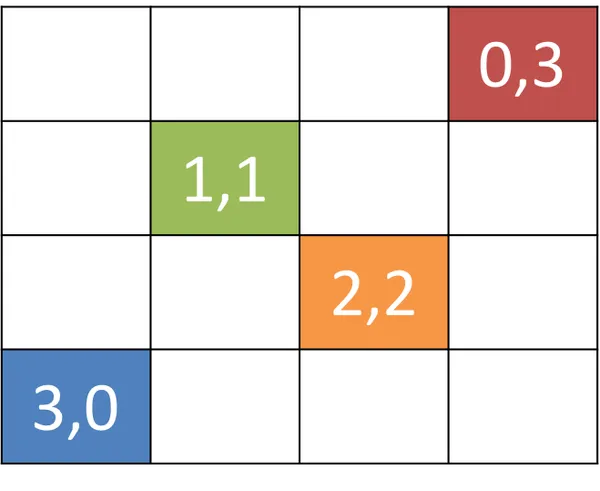
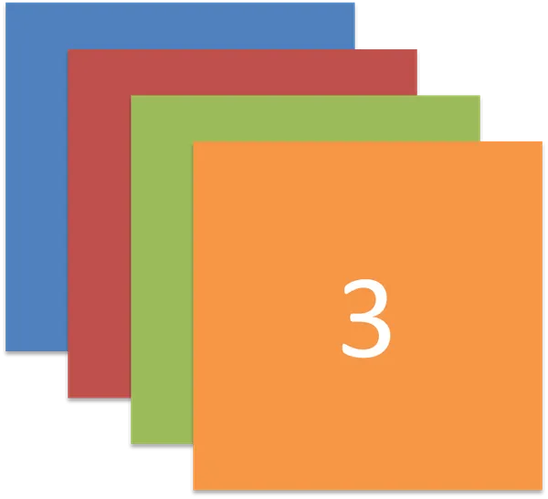
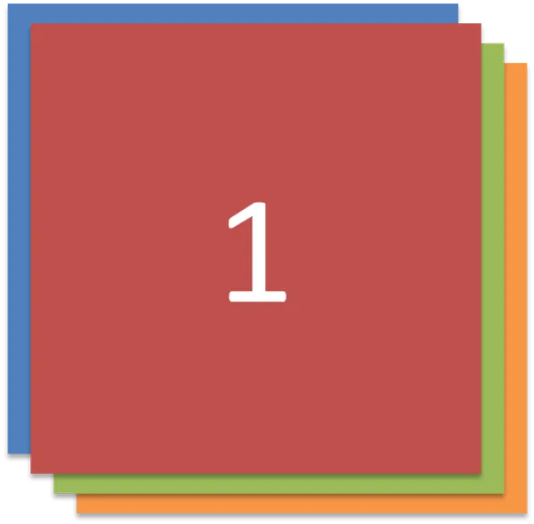
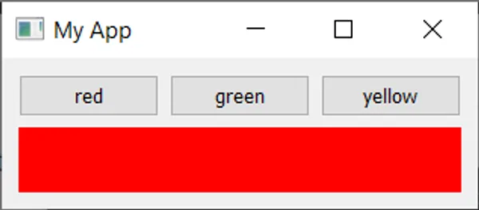
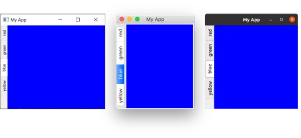
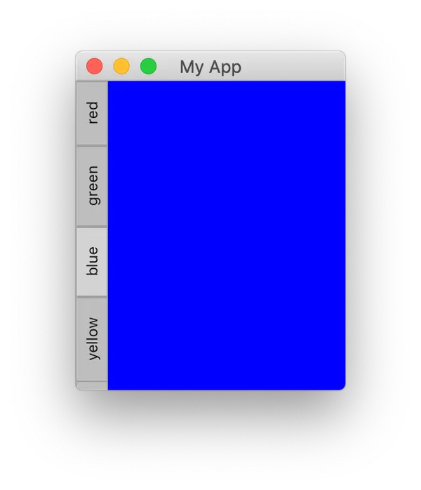

# PyQt5 布局

到目前为止，我们已经成功创建了一个窗口，并在其中添加了一个小部件。然而，通常我们希望在一个窗口中添加多个小部件，并对其位置进行一些控制。在Qt中，为了实现这一点，我们使用布局（layouts）。Qt中有四种基本的布局，它们列在下表中。

|布局|行为|
|-|-|
|QHBoxLayout|线性水平布局|
|QVBoxLayout|线性垂直布局|
|QGridLayout|可索引的网格 X*Y|
|QStackedLayout|堆叠在彼此前面（z 轴方向）|

你还可以使用Qt设计师以图形方式设计和布局界面。在这里，我们使用代码，这样你可以理解底层的系统。

正如你所见，Qt中有三种可用的位置布局，即VBoxLayout、HBoxLayout和QGridLayout。此外，还有QStackedLayout，它允许你在相同的空间中将小部件放置在彼此之上，但一次只显示一个布局。

在我们开始之前，我们需要一个简单的应用程序轮廓。将以下代码保存在一个名为app.py的文件中，我们将修改此应用程序以尝试不同的布局。

```python
import sys
from PyQt5.QtWidgets import QApplication, QMainWindow, QWidget
from PyQt5.QtGui import QPalette, QColor

class MainWindow(QMainWindow):

    def __init__(self):
        super(MainWindow, self).__init__()

        self.setWindowTitle("My App")

app = QApplication(sys.argv)

window = MainWindow()
window.show()

app.exec()
```

为了更容易可视化布局，我们首先将创建一个简单的自定义小部件，显示我们选择的纯色。这将有助于区分我们添加到布局中的小部件。将以下代码作为一个新类添加到文件的顶层：

```python
class Color(QWidget):

    def __init__(self, color):
        super(Color, self).__init__()
        self.setAutoFillBackground(True)

        palette = self.palette()
        palette.setColor(QPalette.Window, QColor(color))
        self.setPalette(palette)
```

在这段代码中，我们通过子类化QWidget来创建自己的自定义小部件Color。在创建小部件时，我们接受一个参数color（一个字符串）。首先，我们将.setAutoFillBackground设置为True，以告诉小部件自动用窗口颜色填充其背景。接下来，我们获取当前调色板（默认情况下是全局桌面调色板），并将当前QPalette.Window颜色更改为我们传入的color值描述的新QColor。最后，我们将此调色板应用回小部件。最终的结果是一个用我们创建时指定的纯色填充的小部件。

如果你觉得上面的解释有点混乱，不用太担心。我们稍后会更详细地介绍自定义小部件。目前，你只需要理解通过以下方式调用，你可以创建一个填充为红色的小部件：

```python
Color('red')
```

首先，让我们通过使用它来将整个窗口填充为单一颜色来测试我们的新Color小部件。完成后，我们可以使用.setCentralWidget将其添加到QMainWindow中，从而得到一个纯红窗口。

```python
class MainWindow(QMainWindow):

    def __init__(self):
        super(MainWindow, self).__init__()

        self.setWindowTitle("My App")

        widget = Color('red')
        self.setCentralWidget(widget)
```

运行它！窗口将出现，完全填充为红色。注意小部件如何扩展以填充所有可用的空间。

接下来，我们将依次查看每个可用的Qt布局。请注意，为了将布局添加到窗口中，我们将需要一个虚拟的QWidget来容纳布局。

### QVBoxLayout

QVBoxLayout是将小部件垂直排列的布局方式。使用QVBoxLayout，您可以线性地将小部件一个接一个地放置在彼此上方。将小部件添加到布局时，它会被添加到列的底部。



让我们将我们的小部件添加到布局中。请注意，为了将布局添加到QMainWindow中，我们需要将其应用到一个虚拟的QWidget上。这样我们就可以使用.setCentralWidget将小部件（和布局）应用到窗口上。我们的有颜色的小部件将自动在布局中排列，该布局包含在窗口的QWidget中。首先，我们只添加红色小部件，如之前所示。

```python
class MainWindow(QMainWindow):

    def __init__(self):
        super(MainWindow, self).__init__()

        self.setWindowTitle("My App")

        layout = QVBoxLayout()

        layout.addWidget(Color('red'))

        widget = QWidget()
        widget.setLayout(layout)
        self.setCentralWidget(widget)
```

运行它！注意现在红色小部件周围可见的边框。这是布局间距 — 我们稍后会看到如何调整它。

如果您向布局中添加更多的有颜色的小部件，您会注意到它们按照添加的顺序在垂直方向上对齐。

```python
class MainWindow(QMainWindow):

    def __init__(self):
        super(MainWindow, self).__init__()

        self.setWindowTitle("My App")

        layout = QVBoxLayout()

        layout.addWidget(Color('red'))
        layout.addWidget(Color('green'))
        layout.addWidget(Color('blue'))

        widget = QWidget()
        widget.setLayout(layout)
        self.setCentralWidget(widget)
```

### QHBoxLayout

QHBoxLayout是相同的，只是水平移动。添加小部件会将其添加到右侧。



要使用它，我们只需将QVBoxLayout更改为QHBoxLayout。方框现在从左到右流动。

```python
class MainWindow(QMainWindow):

    def __init__(self):
        super(MainWindow, self).__init__()

        self.setWindowTitle("My App")

        layout = QHBoxLayout()

        layout.addWidget(Color('red'))
        layout.addWidget(Color('green'))
        layout.addWidget(Color('blue'))

        widget = QWidget()
        widget.setLayout(layout)
        self.setCentralWidget(widget)
```

### 嵌套布局

对于更复杂的布局，您可以使用在布局上使用.addLayout将布局嵌套在另一个布局中。下面我们在主要的QHBoxLayout中添加一个QVBoxLayout。如果我们将一些小部件添加到QVBoxLayout中，它们将在父布局的第一个插槽中垂直排列。

```python
class MainWindow(QMainWindow):

    def __init__(self):
        super(MainWindow, self).__init__()

        self.setWindowTitle("My App")

        layout1 = QHBoxLayout()
        layout2 = QVBoxLayout()
        layout3 = QVBoxLayout()

        layout2.addWidget(Color('red'))
        layout2.addWidget(Color('yellow'))
        layout2.addWidget(Color('purple'))

        layout1.addLayout(layout2)

        layout1.addWidget(Color('green'))

        layout3.addWidget(Color('red'))
        layout3.addWidget(Color('purple'))

        layout1.addLayout(layout3)

        widget = QWidget()
        widget.setLayout(layout1)
        self.setCentralWidget(widget)
```

> 运行它！小部件应该以横向3列的方式排列，其中第一列还包含3个以垂直方式堆叠的小部件。尽情尝试！

您可以使用.setContentsMargins设置布局周围的间距，或者使用.setSpacing设置元素之间的间距。

```python
layout1.setContentsMargins(0, 0, 0, 0)
layout1.setSpacing(20)
```

以下代码显示了嵌套小部件和布局边距以及间距的组合。尝试使用不同的数字，直到您对它们有所了解。

```python
class MainWindow(QMainWindow):

    def __init__(self):
        super(MainWindow, self).__init__()

        self.setWindowTitle("My App")

        layout1 = QHBoxLayout()
        layout2 = QVBoxLayout()
        layout3 = QVBoxLayout()

        layout1.setContentsMargins(0, 0, 0, 0)
        layout1.setSpacing(20)

        layout2.addWidget(Color('red'))
        layout2.addWidget(Color('yellow'))
        layout2.addWidget(Color('purple'))

        layout1.addLayout(layout2)

        layout1.addWidget(Color('green'))

        layout3.addWidget(Color('red'))
        layout3.addWidget(Color('purple'))

        layout1.addLayout(layout3)

        widget = QWidget()
        widget.setLayout(layout1)
        self.setCentralWidget(widget)
```

### QGridLayout小部件以网格方式排列

尽管QVBoxLayout和QHBoxLayout非常有用，但如果您尝试使用它们来布置多个元素，例如用于表单，您会发现很难确保不同大小的小部件对齐。解决这个问题的方法是使用QGridLayout。



QGridLayout允许您在网格中具体位置放置项目。您为每个小部件指定行和列位置。您可以跳过元素，它们将被留空。

值得注意的是，对于QGridLayout，您不需要填充网格中的所有位置。



```python
class MainWindow(QMainWindow):

    def __init__(self):
        super(MainWindow, self).__init__()

        self.setWindowTitle("My App")

        layout = QGridLayout()

        layout.addWidget(Color('red'), 0, 0)
        layout.addWidget(Color('green'), 1, 0)
        layout.addWidget(Color('blue'), 1, 1)
        layout.addWidget(Color('purple'), 2, 1)

        widget = QWidget()
        widget.setLayout(layout)
        self.setCentralWidget(widget)
```

### QStackedLayout多个小部件共享相同空间

我们将要介绍的最后一种布局是QStackedLayout。正如描述的那样，该布局允许您直接将元素放置在彼此前面。然后，您可以选择要显示哪个小部件。您可以将其用于在图形应用程序中绘制图层，或者模拟类似选项卡的界面。请注意，还有QStackedWidget，它是一个以完全相同方式工作的容器小部件。如果您想要直接将一个堆栈添加到QMainWindow中，可以使用`.setCentralWidget`。






```python
from PyQt5.QtWidgets import QStackedLayout  # 添加此导入语句


class MainWindow(QMainWindow):
    def __init__(self):
        super().__init__()

        self.setWindowTitle("My App")

        layout = QStackedLayout()

        layout.addWidget(Color("red"))
        layout.addWidget(Color("green"))
        layout.addWidget(Color("blue"))
        layout.addWidget(Color("yellow"))

        layout.setCurrentIndex(3)

        widget = QWidget()
        widget.setLayout(layout)
        self.setCentralWidget(widget)
```

QStackedWidget正好是应用程序中选项卡视图的工作方式。一次只有一个视图（'标签'）可见。您可以使用`.setCurrentIndex()`或`.setCurrentWidget()`在任何时候控制要显示的小部件，通过索引（按照添加小部件的顺序）或通过小部件本身。

下面是一个使用QStackedLayout与QButton结合的简短演示，为应用程序提供类似选项卡的界面：

```python
import sys

from PyQt5.QtCore import Qt
from PyQt5.QtWidgets import (
    QApplication,
    QHBoxLayout,
    QLabel,
    QMainWindow,
    QPushButton,
    QStackedLayout,
    QVBoxLayout,
    QWidget,
)

from layout_colorwidget import Color


class MainWindow(QMainWindow):
    def __init__(self):
        super().__init__()

        self.setWindowTitle("My App")

        pagelayout = QVBoxLayout()
        button_layout = QHBoxLayout()
        self.stacklayout = QStackedLayout()

        pagelayout.addLayout(button_layout)
        pagelayout.addLayout(self.stacklayout)

        btn = QPushButton("red")
        btn.pressed.connect(self.activate_tab_1)
        button_layout.addWidget(btn)
        self.stacklayout.addWidget(Color("red"))

        btn = QPushButton("green")
        btn.pressed.connect(self.activate_tab_2)
        button_layout.addWidget(btn)
        self.stacklayout.addWidget(Color("green"))

        btn = QPushButton("yellow")
        btn.pressed.connect(self.activate_tab_3)
        button_layout.addWidget(btn)
        self.stacklayout.addWidget(Color("yellow"))

        widget = QWidget()
        widget.setLayout(pagelayout)
        self.setCentralWidget(widget)

    def activate_tab_1(self):
        self.stacklayout.setCurrentIndex(0)

    def activate_tab_2(self):
        self.stacklayout.setCurrentIndex(1)

    def activate_tab_3(self):
        self.stacklayout.setCurrentIndex(2)


app = QApplication(sys.argv)

window = MainWindow()
window.show()

app.exec()
```



有帮助的是，Qt实际上提供了一个内置的TabWidget，它提供了这种类型的布局，尽管是以小部件的形式。以下是使用QTabWidget重新创建选项卡演示：

```python
import sys

from PyQt5.QtCore import Qt
from PyQt5.QtWidgets import (
    QApplication,
    QLabel,
    QMainWindow,
    QPushButton,
    QTabWidget,
    QWidget,
)

from layout_colorwidget import Color


class MainWindow(QMainWindow):
    def __init__(self):
        super().__init__()

        self.setWindowTitle("My App")

        tabs = QTabWidget()
        tabs.setTabPosition(QTabWidget.West)
        tabs.setMovable(True)

        for n, color in enumerate(["red", "green", "blue", "yellow"]):
            tabs.addTab(Color(color), color)

        self.setCentralWidget(tabs)


app = QApplication(sys.argv)

window = MainWindow()
window.show()

app.exec()
```



正如您所看到的，这种方法更为简单，而且看起来更加吸引人！您可以使用基本方向设置选项卡的位置，使用`.setMoveable`切换选项卡是否可移动。您会注意到，macOS上的选项卡栏看起来与其他平台上的不同 - 在macOS上，默认情况下，选项卡采用了匹配或气泡样式。在macOS上，这通常用于选项卡式的配置面板。对于文档，您可以启用文档模式，以获得类似于在其他平台上看到的纤细选项卡。此选项对其他平台无效。

```python
tabs = QTabWidget()
tabs.setDocumentMode(True)
```



我们将在后面遇到更多这些高级小部件。
