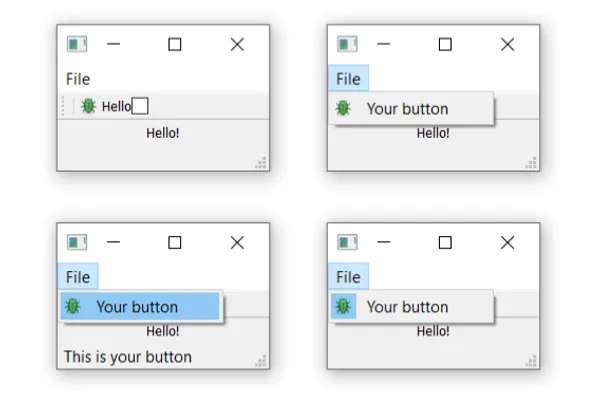

# 4.工具栏，菜单和QAction

接下来，我们将查看一些常见的用户界面元素，这些元素在许多其他应用程序中可能已经看到了 — 工具栏和菜单。我们还将探讨Qt提供的一个很好的系统，用于最大限度地减少不同UI区域之间的重复 — QAction。

## 认识工具栏

### 工具栏

工具栏是最常见的用户界面元素之一。工具栏是一系列图标和/或文本的条，用于在应用程序中执行常见任务，通过菜单访问这些任务可能会很繁琐。它们是许多应用程序中最常见的UI功能之一。虽然一些复杂的应用程序，特别是Microsoft Office套件中的一些应用程序，已经迁移到了上下文的“ribbon”界面，但标准工具栏通常对您将创建的大多数应用程序来说已经足够了。


我们将从一个简单的骨架应用程序开始，然后进行自定义。将以下代码保存在名为app.py的文件中，其中包含了您在后续步骤中需要的所有导入。

```python
import sys
from PyQt5.QtWidgets import (
    QMainWindow, QApplication,
    QLabel, QToolBar, QAction, QStatusBar
)
from PyQt5.QtGui import QIcon
from PyQt5.QtCore import Qt

class MainWindow(QMainWindow):

    def __init__(self):
        super(MainWindow, self).__init__()

        self.setWindowTitle("My Awesome App")


app = QApplication(sys.argv)
w = MainWindow()
w.show()
app.exec()
```

## 添加工具栏

让我们首先向应用程序添加一个工具栏。

在Qt中，工具栏是使用QToolBar类创建的。首先，您创建该类的一个实例，然后在QMainWindow上调用`.addToolBar`。将字符串作为第一个参数传递给QToolBar将设置工具栏的名称，该名称将用于在UI中标识工具栏。

```python
class MainWindow(QMainWindow):

    def __init__(self):
        super(MainWindow, self).__init__()

        self.setWindowTitle("My Awesome App")

        label = QLabel("Hello!")
        label.setAlignment(Qt.AlignCenter)

        self.setCentralWidget(label)

        toolbar = QToolBar("My main toolbar")
        self.addToolBar(toolbar)


    def onMyToolBarButtonClick(self, s):
        print("click", s)
```

> 运行它！您将看到窗口顶部有一条细灰色条。这就是您的工具栏。右键单击并单击名称以切换它。


> 我怎么把我的工具栏找回来？不幸的是，一旦您删除了工具栏，就没有地方可以右键单击以重新添加它。因此，通常规则是要么保留一个不可移除的工具栏，要么在菜单中提供替代界面以打开和关闭工具栏。

我们应该使工具栏变得更有趣。我们可以只添加一个QButton小部件，但在Qt中有一种更好的方法，可以为您提供一些额外的功能 — 通过QAction。QAction是一个提供描述抽象用户界面的方法的类。这在英语中意味着您可以在单个对象中定义多个接口元素，这些元素由与该元素交互的效果统一。例如，通常在工具栏和菜单中都有表示函数的功能 — 想象一下像“编辑->剪切”这样的功能，它不仅在“编辑”菜单中出现，而且在工具栏上出现为一对剪刀，还可以通过键盘快捷键Ctrl-X（Mac上为Cmd-X）触发。

如果没有QAction，您将不得不在多个位置定义这个功能。但是使用QAction，您可以定义一个单独的QAction，定义触发的动作，然后将此动作添加到菜单和工具栏。每个QAction都有名称、状态消息、图标和您可以连接到的信号（以及更多）。

在下面的代码中，您可以看到第一个添加的QAction。

```python
class MainWindow(QMainWindow):

    def __init__(self):
        super(MainWindow, self).__init__()

        self.setWindowTitle("My Awesome App")

        label = QLabel("Hello!")
        label.setAlignment(Qt.AlignCenter)

        self.setCentralWidget(label)

        toolbar = QToolBar("My main toolbar")
        self.addToolBar(toolbar)

        button_action = QAction("Your button", self)
        button_action.setStatusTip("This is your button")
        button_action.triggered.connect(self.onMyToolBarButtonClick)
        toolbar.addAction(button_action)

    def onMyToolBarButtonClick(self, s):
        print("click", s)
```

首先，我们创建将接受来自QAction的信号的函数，以便我们可以查看它是否起作用。接下来，我们定义QAction本身。在创建实例时，我们可以传递操作的标签和/或图标。您还必须传递任何QObject作为操作的父项 — 在这里，我们将self作为对主窗口的引用进行传递。奇怪的是，对于QAction，父元素是作为最后一个参数传递的。

接下来，我们可以选择设置状态提示 — 一旦我们有了状态栏，此文本将显示在状态栏上。最后，我们将`.triggered`信号连接到自定义函数。每当触发（或激活）QAction时，此信号将触发。

> 运行它！您应该看到您定义的带有标签的按钮。单击它，我们的自定义函数将发出“click”和按钮的状态。


> 为什么信号始终为False？传递的信号表示按钮是否已选中，由于我们的按钮不可选 — 只能单击 — 因此它始终为False。我们将展示如何使其可选。

接下来，我们可以添加一个状态栏。

我们通过调用QStatusBar来获取一个新的状态栏对象，然后将其传递到`.setStatusBar`中，从而创建一个状态栏对象。由于我们不需要更改状态栏的设置，我们也可以在创建时将其作为参数传递，这样可以在单个行中完成：

```python
class MainWindow(QMainWindow):

    def __init__(self):
        super(MainWindow, self).__init__()

        self.setWindowTitle("My Awesome App")

        label = QLabel("Hello!")
        label.setAlignment(Qt.AlignCenter)

        self.setCentralWidget(label)

        toolbar = QToolBar("My main toolbar")
        self.addToolBar(toolbar)

        button_action = QAction("Your button", self)
        button_action.setStatusTip("This is your button")
        button_action.triggered.connect(self.onMyToolBarButtonClick)
        toolbar.addAction(button_action)

        self.setStatusBar(QStatusBar(self))


    def onMyToolBarButtonClick(self, s):
        print("click", s)
```

> 运行它！将鼠标悬停在工具栏按钮上，您将在状态栏中看到状态文本。


接下来，我们将使我们的QAction可切换 — 即单击将其打开，再次单击将其关闭。为此，我们只需在QAction对象上调用`setCheckable(True)`。

```python
class MainWindow(QMainWindow):

    def __init__(self):
        super(MainWindow, self).__init__()

        self.setWindowTitle("My Awesome App")

        label = QLabel("Hello!")
        label.setAlignment(Qt.AlignCenter)

        self.setCentralWidget(label)

        toolbar = QToolBar("My main toolbar")
        self.addToolBar(toolbar)

        icon_path = 'bug.png'  # Change this to the path of your icon file
        button_action = QAction(QIcon(icon_path), "Your button", self)
        button_action.setStatusTip("This is your button")
        button_action.triggered.connect(self.onMyToolBarButtonClick)
        button_action.setCheckable(True)
        toolbar.addAction(button_action)

        self.setStatusBar(QStatusBar(self))

    def onMyToolBarButtonClick(self, s):
        print("click", s)
```

> 运行它！单击按钮，看它从选中状态切换到未选中状态。请注意，我们现在创建的自定义槽函数交替输出True和False。


> 还有一个`.toggled`信号，仅在切换按钮时发出信号。但效果是相同的，所以它基本上是无意义的。

现在事情看起来相当简陋 — 所以让我们为我们的按钮添加一个图标。为此，我建议您下载设计师Yusuke Kamiyamane的fugue图标集。这是一组美丽的16x16图标，可以使您的应用程序看起来非常专业。在您分发应用程序时，它是免费提供的，只需要属性 — 虽然我相信设计师如果您有多余的现金也会感激的。


[Fugue图标集](http://p.yusukekamiyamane.com/) — Yusuke Kamiyamane

从该集合中选择一个图像（在这里的示例中，我选择了文件bug.png），并将其复制到与您的源代码相同的文件夹中。我们可以通过将文件名传递给类来创建一个QIcon对象，例如`QIcon('bug.png')` — 如果将文件放在另一个文件夹中，则需要相对或绝对路径。最后，要将图标添加到QAction（因此也是按钮），我们只需在创建QAction时将其作为第一个参数传递即可。

您还需要让工具栏知道图标的大小，否则您的图标将被大量填充。您可以通过使用 QSize 对象调用 `.setIconSize()` 来实现这一点。

```python
class MainWindow(QMainWindow):

    def __init__(self):
        super(MainWindow, self).__init__()

        self.setWindowTitle("My Awesome App")

        label = QLabel("Hello!")
        label.setAlignment(Qt.AlignCenter)

        self.setCentralWidget(label)

        toolbar = QToolBar("My main toolbar")
        toolbar.setIconSize(QSize(16,16))
        self.addToolBar(toolbar)

        button_action = QAction(QIcon("bug.png"), "Your button", self)
        button_action.setStatusTip("This is your button")
        button_action.triggered.connect(self.onMyToolBarButtonClick)
        button_action.setCheckable(True)
        toolbar.addAction(button_action)

        self.setStatusBar(QStatusBar(self))


    def onMyToolBarButtonClick(self, s):
        print("click", s)
```

> 运行它！现在，QAction由一个图标表示。一切应该与之前完全一样。


> 请注意，Qt使用您的操作系统默认设置来确定在工具栏中显示图标、文本或图标和文本。但是，您可以通过使用`.setToolButtonStyle`来覆盖这一点。此插槽接受Qt的以下命名空间中的任何以下标志：

|PyQt5标志|行为|
| - | - |
|Qt.ToolButtonIconOnly|仅图标，无文本|
|Qt.ToolButtonTextOnly|仅文本，无图标|
|Qt.ToolButtonTextBesideIcon|图标和文本，文本位于图标旁边|
|Qt.ToolButtonTextUnderIcon|图标和文本，文本位于图标下方|
|Qt.ToolButtonFollowStyle|跟随主机桌面样式|

默认值为Qt.ToolButtonFollowStyle，这意味着您的应用程序将默认遵循应用程序运行的桌面的标准/全局设置。通常建议这样做，以使您的应用程序尽可能感觉自然。

最后，我们可以在工具栏上添加一些额外的小部件。我们将添加第二个按钮和一个复选框小部件。正如前文所述，你可以在这里放置任何小部件，所以随意尝试。

```python
import sys

from PyQt5.QtCore import QSize, Qt
from PyQt5.QtGui import QIcon
from PyQt5.QtWidgets import (
    QAction,
    QApplication,
    QCheckBox,
    QLabel,
    QMainWindow,
    QStatusBar,
    QToolBar,
)

class MainWindow(QMainWindow):
    def __init__(self):
        super().__init__()

        self.setWindowTitle("My App")

        label = QLabel("Hello!")
        label.setAlignment(Qt.AlignCenter)

        self.setCentralWidget(label)

        toolbar = QToolBar("My main toolbar")
        toolbar.setIconSize(QSize(16, 16))
        self.addToolBar(toolbar)

        button_action = QAction(QIcon("bug.png"), "&Your button", self)
        button_action.setStatusTip("This is your button")
        button_action.triggered.connect(self.onMyToolBarButtonClick)
        button_action.setCheckable(True)
        toolbar.addAction(button_action)

        toolbar.addSeparator()

        button_action2 = QAction(QIcon("bug.png"), "Your &button2", self)
        button_action2.setStatusTip("This is your button2")
        button_action2.triggered.connect(self.onMyToolBarButtonClick)
        button_action2.setCheckable(True)
        toolbar.addAction(button_action2)

        toolbar.addWidget(QLabel("Hello"))
        toolbar.addWidget(QCheckBox())

        self.setStatusBar(QStatusBar(self))

    def onMyToolBarButtonClick(self, s):
        print("click", s)


app = QApplication(sys.argv)

window = MainWindow()
window.show()

app.exec()
```

> 运行它！现在你可以看到多个按钮和一个复选框。


## 菜单

菜单是 UI 的另一个标准组件。通常它们位于窗口的顶部，或者在 macOS 上位于屏幕的顶部。它们允许访问所有标准应用程序功能。有一些标准菜单存在，例如文件（File）、编辑（Edit）、帮助（Help）。菜单可以嵌套，以创建功能的分层树形结构，它们通常支持并显示用于快速访问功能的键盘快捷键。


要创建菜单，我们通过在 QMainWindow 上调用 .menuBar() 来创建一个菜单栏。我们通过调用 .addMenu() 在菜单栏上添加一个菜单，传递菜单的名称。我将其命名为'&File'。与符号定义了按下 Alt 键时跳转到此菜单的快捷键。

> 这在 macOS 上不会显示。请注意，这与键盘快捷键不同 — 我们将很快介绍这个。

这就是使用action操作的威力所在。我们可以重用已经存在的 QAction，将相同的功能添加到菜单中。要添加一个action操作，调用 .addAction，传递我们已定义的操作之一。

```python
class MainWindow(QMainWindow):
    def __init__(self):
        super().__init__()

        self.setWindowTitle("My App")

        label = QLabel("Hello!")
        label.setAlignment(Qt.AlignCenter)

        self.setCentralWidget(label)

        toolbar = QToolBar("My main toolbar")
        toolbar.setIconSize(QSize(16, 16))
        self.addToolBar(toolbar)

        button_action = QAction(QIcon("bug.png"), "&Your button", self)
        button_action.setStatusTip("This is your button")
        button_action.triggered.connect(self.onMyToolBarButtonClick)
        button_action.setCheckable(True)
        toolbar.addAction(button_action)

        toolbar.addSeparator()

        button_action2 = QAction(QIcon("bug.png"), "Your &button2", self)
        button_action2.setStatusTip("This is your button2")
        button_action2.triggered.connect(self.onMyToolBarButtonClick)
        button_action2.setCheckable(True)
        toolbar.addAction(button_action2)

        toolbar.addWidget(QLabel("Hello"))
        toolbar.addWidget(QCheckBox())

        self.setStatusBar(QStatusBar(self))

        menu = self.menuBar()

        file_menu = menu.addMenu("&File")
        file_menu.addAction(button_action)

    def onMyToolBarButtonClick(self, s):
        print("click", s)
```

单击菜单项，你会注意到它是可切换的 — 它继承了 QAction 的特性。



让我们在菜单中添加一些更多的内容。这里我们将在菜单中添加一个分隔符，它将显示为菜单中的水平线，然后添加我们创建的第二个 QAction。

```python
class MainWindow(QMainWindow):
    def __init__(self):
        super().__init__()

        self.setWindowTitle("My App")

        label = QLabel("Hello!")
        label.setAlignment(Qt.AlignCenter)

        self.setCentralWidget(label)

        toolbar = QToolBar("My main toolbar")
        toolbar.setIconSize(QSize(16, 16))
        self.addToolBar(toolbar)

        button_action = QAction(QIcon("bug.png"), "&Your button", self)
        button_action.setStatusTip("This is your button")
        button_action.triggered.connect(self.onMyToolBarButtonClick)
        button_action.setCheckable(True)
        toolbar.addAction(button_action)

        toolbar.addSeparator()

        button_action2 = QAction(QIcon("bug.png"), "Your &button2", self)
        button_action2.setStatusTip("This is your button2")
        button_action2.triggered.connect(self.onMyToolBarButtonClick)
        button_action2.setCheckable(True)
        toolbar.addAction(button_action2)

        toolbar.addWidget(QLabel("Hello"))
        toolbar.addWidget(QCheckBox())

        self.setStatusBar(QStatusBar(self))

        menu = self.menuBar()

        file_menu = menu.addMenu("&File")
        file_menu.addAction(button_action)
        file_menu.addSeparator()
        file_menu.addAction(button_action2)

    def onMyToolBarButtonClick(self, s):
        print("click", s)
```

> 运行它！你应该看到两个菜单项之间有一条线。


你还可以使用与符号为菜单项添加加速键，允许在打开菜单项时使用单个键跳转到菜单项。再次注意，这在 macOS 上不起作用。

要添加子菜单，只需在父菜单上调用 addMenu() 创建一个新菜单。然后，你可以像平常一样向其中添加操作。例如：

```python
class MainWindow(QMainWindow):
    def __init__(self):
        super().__init__()

        self.setWindowTitle("My App")

        label = QLabel("Hello!")
        label.setAlignment(Qt.AlignCenter)

        self.setCentralWidget(label)

        toolbar = QToolBar("My main toolbar")
        toolbar.setIconSize(QSize(16, 16))
        self.addToolBar(toolbar)

        button_action = QAction(QIcon("bug.png"), "&Your button", self)
        button_action.setStatusTip("This is your button")
        button_action.triggered.connect(self.onMyToolBarButtonClick)
        button_action.setCheckable(True)
        toolbar.addAction(button_action)

        toolbar.addSeparator()

        button_action2 = QAction(QIcon("bug.png"), "Your &button2", self)
        button_action2.setStatusTip("This is your button2")
        button_action2.triggered.connect(self.onMyToolBarButtonClick)
        button_action2.setCheckable(True)
        toolbar.addAction(button_action2)

        toolbar.addWidget(QLabel("Hello"))
        toolbar.addWidget(QCheckBox())

        self.setStatusBar(QStatusBar(self))

        menu = self.menuBar()

        file_menu = menu.addMenu("&File")
        file_menu.addAction(button_action)
        file_menu.addSeparator()

        file_submenu = file_menu.addMenu("Submenu")
        file_submenu.addAction(button_action2)

    def onMyToolBarButtonClick(self, s):
        print("click", s)
```


最后，我们将为 QAction 添加一个键盘快捷键。通过调用 setKeySequence() 并传递键序列来定义键盘快捷键。任何已定义的键序列都将出现在菜单中。

> 请注意，键盘快捷键与 QAction 关联，并且无论 QAction 是否添加到菜单或工具栏，它都仍然起作用。

键序列可以以多种方式定义 - 通过文本传递，使用 Qt 命名空间中的键名称，或使用 Qt 命名空间中定义的键序列。在能够使用的地方最好使用后者，以确保符合操作系统标准。

以下是显示工具栏按钮和菜单的完整代码：

```python
class MainWindow(QMainWindow):
    def __init__(self):
        super().__init__()

        self.setWindowTitle("My App")

        label = QLabel("Hello!")

        # The `Qt` namespace has a lot of attributes to customize
        # widgets. See: http://doc.qt.io/qt-5/qt.html
        label.setAlignment(Qt.AlignCenter)

        # Set the central widget of the Window. Widget will expand
        # to take up all the space in the window by default.
        self.setCentralWidget(label)

        toolbar = QToolBar("My main toolbar")
        toolbar.setIconSize(QSize(16, 16))
        self.addToolBar(toolbar)

        button_action = QAction(QIcon("bug.png"), "&Your button", self)
        button_action.setStatusTip("This is your button")
        button_action.triggered.connect(self.onMyToolBarButtonClick)
        button_action.setCheckable(True)
        # You can enter keyboard shortcuts using key names (e.g. Ctrl+p)
        # Qt.namespace identifiers (e.g. Qt.CTRL + Qt.Key_P)
        # or system agnostic identifiers (e.g. QKeySequence.Print)
        button_action.setShortcut(QKeySequence("Ctrl+p"))
        toolbar.addAction(button_action)

        toolbar.addSeparator()

        button_action2 = QAction(QIcon("bug.png"), "Your &button2", self)
        button_action2.setStatusTip("This is your button2")
        button_action2.triggered.connect(self.onMyToolBarButtonClick)
        button_action2.setCheckable(True)
        toolbar.addAction(button_action)

        toolbar.addWidget(QLabel("Hello"))
        toolbar.addWidget(QCheckBox())

        self.setStatusBar(QStatusBar(self))

        menu = self.menuBar()

        file_menu = menu.addMenu("&File")
        file_menu.addAction(button_action)

        file_menu.addSeparator()

        file_submenu = file_menu.addMenu("Submenu")

        file_submenu.addAction(button_action2)

    def onMyToolBarButtonClick(self, s):
        print("click", s)
```

使用 `QAction` 和 `QMenu` 尝试构建自己的菜单。
