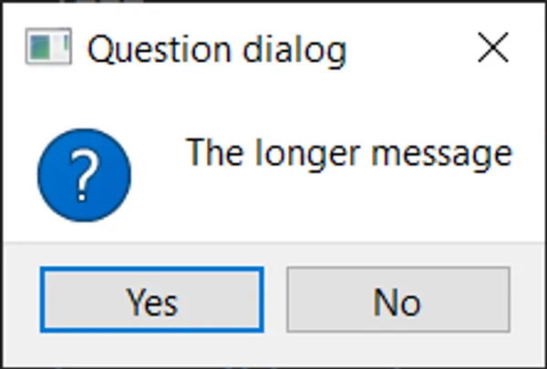

# 对话框和alert通知

## 认识对话框

对话框是一种有用的 GUI 组件，允许您与用户进行通信（因此称为对话框）。它们通常用于文件的打开/保存、设置、首选项或不适用于主应用程序 UI 的功能。它们是小型模态（或阻塞）窗口，一直显示在主应用程序的前面，直到它们被关闭。Qt 提供了一些内置对话框，用于最常见的用例，使您能够提供本地平台用户体验。


在 Qt 中，对话框由 `QDialog` 类处理。要创建一个新的对话框，只需创建 `QDialog` 类型的新对象，将另一个小部件（例如 `QMainWindow`）作为其父级传递。

让我们创建自己的 `QDialog`。我们将从一个简单的骨架应用程序开始，其中包含一个按钮，按下按钮后会触发一个槽方法。

```python
import sys
from PyQt5.QtWidgets import QApplication, QMainWindow, QPushButton

class MainWindow(QMainWindow):
    def __init__(self):
        super().__init__()

        self.setWindowTitle("My App")

        button = QPushButton("Press me for a dialog!")
        button.clicked.connect(self.button_clicked)
        self.setCentralWidget(button)

    def button_clicked(self, s):
        print("click", s)


app = QApplication(sys.argv)

window = MainWindow()
window.show()

app.exec()
```

在 `button_clicked` 槽中（该槽接收来自按钮按下的信号），我们创建对话框实例，将我们的 QMainWindow 实例作为父级传递。这将使对话框成为 QMainWindow 的模态窗口。这意味着对话框将完全阻止与父窗口的交互。

```python
import sys
from PyQt5.QtWidgets import QApplication, QDialog, QMainWindow, QPushButton

class MainWindow(QMainWindow):
    def __init__(self):
        super().__init__()

        self.setWindowTitle("My App")

        button = QPushButton("Press me for a dialog!")
        button.clicked.connect(self.button_clicked)
        self.setCentralWidget(button)

    def button_clicked(self, s):
        print("click", s)

        dlg = QDialog(self)
        dlg.setWindowTitle("HELLO!")
        dlg.exec()


app = QApplication(sys.argv)

window = MainWindow()
window.show()

app.exec()
```

> <p style="color:green">运行它！单击按钮，您将看到一个空的对话框出现。</p>

一旦我们创建了对话框，我们就使用 `.exec()` 启动它 - 就像我们为 QApplication 创建主事件循环一样。这不是巧合：当您执行 QDialog 时，将创建一个完全独立的事件循环 - 专用于对话框。

> <p style="color:#376FB6">QDialog 完全阻塞了您的应用程序执行。不要启动对话框并期望应用程序的任何其他地方发生其他事情。稍后我们将看到如何使用线程和进程来解决这个问题。</p>


与我们的第一个窗口一样，这并不是很有趣。我们将通过添加对话框标题和一组 OK 和 Cancel 按钮来解决这个问题，以允许用户接受或拒绝模态。

要自定义 QDialog，我们可以对其进行子类化。

```python
from PyQt5.QtWidgets import QDialog, QDialogButtonBox, QVBoxLayout, QLabel

class CustomDialog(QDialog):
    def __init__(self):
        super().__init__()

        self.setWindowTitle("HELLO!")

        QBtn = QDialogButtonBox.Ok | QDialogButtonBox.Cancel

        self.buttonBox = QDialogButtonBox(QBtn)
        self.buttonBox.accepted.connect(self.accept)
        self.buttonBox.rejected.connect(self.reject)

        self.layout = QVBoxLayout()
        message = QLabel("Something happened, is that OK?")
        self.layout.addWidget(message)
        self.layout.addWidget(self.buttonBox)
        self.setLayout(self.layout)
```

在上面的代码中，我们首先创建了 QDialog 的子类，我们将其称为 CustomDialog。与 QMainWindow 一样，我们在类的 `__init__` 块中应用我们的自定义设置，以便在创建对象时应用这些自定义设置。首先，我们使用 `.setWindowTitle()` 为 QDialog 设置标题，与我们为主窗口所做的完全相同。

接下来的代码块涉及创建和显示对话框按钮。这可能比您预期的要复杂一些。但是，这是由于 Qt 在处理不同平台上的对话框按钮位置时的灵活性。

> <p style="color:red">当然，您可以选择忽略这一点，使用布局中的标准 QButton，但是这里概述的方法确保您的对话框遵循主机桌面标准（例如，左侧的 OK 与右侧的 OK）。改变这些行为可能会让您的用户感到非常烦恼，因此我不建议这样做。</p>

创建对话框按钮框的第一步是使用 QDialogButtonBox 的命名空间属性定义要显示的按钮，完整的按钮列表如下：

- `QDialogButtonBox.Ok`
- `QDialogButtonBox.Open`
- `QDialogButtonBox.Save`
- `QDialogButtonBox.Cancel`
- `QDialogButtonBox.Close`
- `QDialogButtonBox.Discard`
- `QDialogButtonBox.Apply`
- `QDialogButtonBox.Reset`
- `QDialogButtonBox.RestoreDefaults`
- `QDialogButtonBox.Help`
- `QDialogButtonBox.SaveAll`
- `QDialogButtonBox.Yes`
- `QDialogButtonBox.YesToAll`
- `QDialogButtonBox.No`
- `QDialogButtonBox.Abort`
- `QDialogButtonBox.Retry`
- `QDialogButtonBox.Ignore`
- `QDialogButtonBox.NoButton`

这些应足以创建您能想到的任何对话框。您可以通过使用竖线（|）将它们 OR 在一起来构造多个按钮的行。Qt 将根据平台标准自动处理按钮的顺序。例如，要显示 OK 和 Cancel 按钮，我们使用了：

```python
buttons = QDialogButtonBox.Ok | QDialogButtonBox.Cancel
```

变量 `buttons` 现在包含一个整数值，表示这两个按钮。接下来，我们必须创建 QDialogButtonBox 实例以容纳按钮。将要显示的按钮的标志作为第一个参数传递。

为使按钮产生任何效果，必须将 QDialogButtonBox 的正确信号连接到对话框上的槽。在我们的情况下，我们已将 QDialogButtonBox 的 `.accepted` 和 `.rejected` 信号连接到 QDialog 的 `.accept()` 和 `.reject()` 处理程序上。

最后，为了使 QDialogButtonBox 出现在我们的对话框中，我们必须将其添加到对话框布局中。因此，与主窗口一样，我们创建一个布局，并将 QDialogButtonBox 添加到其中（QDialogButtonBox 是一个小部件），然后将该布局设置为我们的对话框。

最后，在我们的 `MainWindow.button_clicked` 槽中启动 CustomDialog。

```python
class MainWindow(QMainWindow):

    # ... 在 __init__ 后添加以下方法

    def button_clicked(self, s):
        print("click", s)

        dlg = CustomDialog()
        if dlg.exec():
            print("Success!")
        else:
            print("Cancel!")
```

> <p style="color:green">运行它！点击以启动对话框，您将看到一个带有按钮的对话框框。</p>


当您点击按钮启动对话框时，您可能会注意到它出现在父窗口外 -- 可能在屏幕中央。通常，您希望对话框出现在其启动窗口上方，以使用户更容易找到它们。为此，我们需要为对话框提供一个父窗口。如果我们将主窗口作为父窗口传递，Qt 将定位新对话框，使其对话框的中心与窗口的中心对齐。

我们可以修改我们的 CustomDialog 类以接受一个父窗口参数。

```PYTHON
class CustomDialog(QDialog):
    def __init__(self, parent=None):
        super().__init__(parent)

        self.setWindowTitle("HELLO!")

        QBtn = QDialogButtonBox.Ok | QDialogButtonBox.Cancel

        self.buttonBox = QDialogButtonBox(QBtn)
        self.buttonBox.accepted.connect(self.accept)
        self.buttonBox.rejected.connect(self.reject)

        self.layout = QVBoxLayout()
        message = QLabel("发生了一些事情，可以吗？")
        self.layout.addWidget(message)
        self.layout.addWidget(self.buttonBox)
        self.setLayout(self.layout)
```

> <p style="color:#B88F12">我们设置 parent=None 的默认值，因此如果愿意，我们可以省略父窗口。</p>

然后，在创建 CustomDialog 实例时，我们可以将主窗口作为参数传递。在 button_clicked 方法中，self 是我们的主窗口对象。

```PYTHON
    def button_clicked(self, s):
        print("click", s)

        dlg = CustomDialog(self)
        if dlg.exec():
            print("Success!")
        else:
            print("Cancel!")
```

> <p style="color:green">运行它！点击以启动对话框，您应该看到对话框弹出在父窗口的中间。</p>


恭喜！您已创建您的第一个对话框框。当然，您可以继续向对话框框中添加任何其他内容。只需像平常一样将其插入布局中。

### 简单的消息对话框与QMessageBox

许多对话框都遵循我们刚刚看到的简单模式——带有可以接受或取消对话框的按钮的消息。虽然您可以自己构建这些对话框，但Qt还提供了一个内置的消息对话框类，称为QMessageBox。这可用于创建信息、警告、关于或问题对话框。

下面的示例创建了一个简单的QMessageBox并显示它。

```python
import sys

from PyQt5.QtWidgets import QApplication, QDialog, QMainWindow, QMessageBox, QPushButton

class MainWindow(QMainWindow):
    def __init__(self):
        super().__init__()

        self.setWindowTitle("My App")

        button = QPushButton("Press me for a dialog!")
        button.clicked.connect(self.button_clicked)
        self.setCentralWidget(button)

    def button_clicked(self, s):
        dlg = QMessageBox(self)
        dlg.setWindowTitle("I have a question!")
        dlg.setText("This is a simple dialog")
        button = dlg.exec()

        if button == QMessageBox.Ok:
            print("OK!")

app = QApplication(sys.argv)

window = MainWindow()
window.show()

app.exec()
```

> <p style="color:green">运行它！您将看到一个带有“确定”按钮的简单对话框。</p>


与我们已经看过的对话框按钮框一样，QMessageBox上显示的按钮也使用相同的一组常量配置，这些常量可以与|（二进制OR运算符）组合以显示多个按钮。可用按钮类型的完整列表如下。

- `QMessageBox.Ok`
- `QMessageBox.Open`
- `QMessageBox.Save`
- `QMessageBox.Cancel`
- `QMessageBox.Close`
- `QMessageBox.Discard`
- `QMessageBox.Apply`
- `QMessageBox.Reset`
- `QMessageBox.RestoreDefaults`
- `QMessageBox.Help`
- `QMessageBox.SaveAll`
- `QMessageBox.Yes`
- `QMessageBox.YesToAll`
- `QMessageBox.No`
- `QMessageBox.NoToAll`
- `QMessageBox.Abort`
- `QMessageBox.Retry`
- `QMessageBox.Ignore`
- `QMessageBox.NoButton`

您还可以通过以下之一设置图标来调整对话框上显示的图标。

|图标状态|描述|
| - | - |
|QMessageBox.NoIcon|消息框没有图标。|
|QMessageBox.Question|消息是一个问题。|
|QMessageBox.Information|消息仅提供信息。|
|QMessageBox.Warning|消息是警告。|
|QMessageBox.Critical|消息指示了一个关键问题。|

例如，以下创建了一个带有是和否按钮的问题对话框。

```python
def button_clicked(self, s):
    dlg = QMessageBox(self)
    dlg.setWindowTitle("I have a question!")
    dlg.setText("This is a question dialog")
    dlg.setStandardButtons(QMessageBox.Yes | QMessageBox.No)
    dlg.setIcon(QMessageBox.Question)
    button = dlg.exec()

    if button == QMessageBox.Yes:
        print("Yes!")
    else:
        print("No!")
```

> <p style="color:green">运行它！您将看到一个带有是和否按钮的问题对话框。</p>


### 内置的QMessageBox对话框

为了使事情变得更简单，QMessageBox有许多方法可用于构建这些类型的消息对话框。这些方法如下所示 --

```python
QMessageBox.about(parent, title, message)
QMessageBox.critical(parent, title, message)
QMessageBox.information(parent, title, message)
QMessageBox.question(parent, title, message)
QMessageBox.warning(parent, title, message)
```

parent参数是对话框将成为其子窗口的窗口。如果您从主窗口启动对话框，可以直接传递self。以下示例创建了一个带有是和否按钮的问题对话框，与之前的示例相同。

```python
def button_clicked(self, s):

    button = QMessageBox.question(self, "Question dialog", "The longer message")

    if button == QMessageBox.Yes:
        print("Yes!")
    else:
        print("No!")
```

> <p style="color:green">运行它！您将看到相同的结果，这次使用内置的.question()方法。</p>



请注意，我们现在不再调用exec()，而是简单地调用对话框方法，对话框就会被创建。每个方法的返回值是按下的按钮。我们可以通过将返回值与按钮常量进行比较来检测已按下什么。

这四个信息、问题、警告和关键方法还接受可选的buttons和defaultButton参数，这些参数可用于调整对话框上显示的按钮并选择一个默认按钮。不过一般来说，您不希望从默认值进行更改。

```python
def button_clicked(self, s):

    button = QMessageBox.critical(
        self,
        "Oh dear!",
        "Something went very wrong.",
        buttons=QMessageBox.Discard | QMessageBox.NoToAll | QMessageBox.Ignore,
        defaultButton=QMessageBox.Discard,
    )

    if button == QMessageBox.Discard:
        print("Discard!")
    elif button == QMessageBox.NoToAll:
        print("No to all!")
    else:
        print("Ignore!")
```

> <p style="color:green">运行它！您将看到一个带有自定义按钮的关键对话框。</p>


对于大多数情况，这些简单的对话框就足够了。
