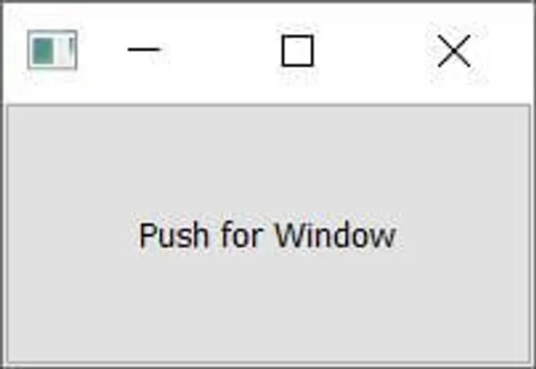
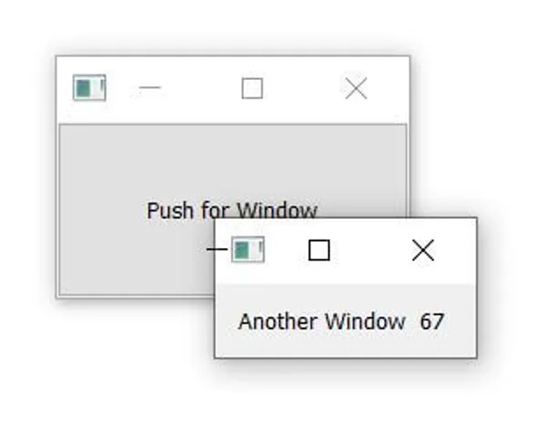
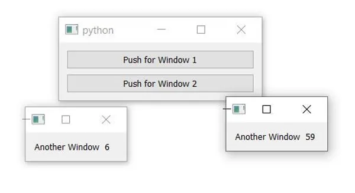

# 创建额外的窗口

在早期的教程中，我们已经介绍了如何打开对话框窗口。这些是特殊窗口，（默认情况下）抓取用户的焦点，并运行它们自己的事件循环，有效地阻止了应用程序其余部分的执行。

然而，通常情况下，您可能希望在应用程序中打开第二个窗口，而不中断主窗口——例如，显示某个长时间运行过程的输出，或显示图形或其他可视化。或者，您可能希望创建一个允许您同时在多个窗口中处理多个文档的应用程序，这些文档各自拥有自己的窗口。

打开新窗口相对简单，但有一些要注意的事项，以确保它们正常运行。在本教程中，我们将逐步介绍如何创建新窗口，以及如何根据需要显示和隐藏外部窗口。

## 创建新窗口

在Qt中，没有父窗口的任何窗口都是窗口。这意味着，要显示一个新窗口，您只需创建一个窗口的新实例。这可以是任何窗口类型（技术上是QWidget的任何子类），包括另一个QMainWindow，如果您愿意的话。

> <p style="color:#C28F12">对于QMainWindow的实例数量没有限制。如果您在第二个窗口上需要工具栏或菜单，您将不得不使用QMainWindow来实现。但这可能会让用户感到困惑，因此请确保这是必要的。</p>

与主窗口一样，创建窗口是不够的，您还必须显示它。

```python
from PyQt5.QtWidgets import QApplication, QMainWindow, QPushButton, QLabel, QVBoxLayout, QWidget

import sys


class AnotherWindow(QWidget):
    """
    This "window" is a QWidget. If it has no parent, it
    will appear as a free-floating window as we want.
    """
    def __init__(self):
        super().__init__()
        layout = QVBoxLayout()
        self.label = QLabel("Another Window")
        layout.addWidget(self.label)
        self.setLayout(layout)


class MainWindow(QMainWindow):

    def __init__(self):
        super().__init__()
        self.button = QPushButton("Push for Window")
        self.button.clicked.connect(self.show_new_window)
        self.setCentralWidget(self.button)

    def show_new_window(self, checked):
        w = AnotherWindow()
        w.show()


app = QApplication(sys.argv)
w = MainWindow()
w.show()
app.exec()
```

{width=50% }

如果您运行此代码，您将看到主窗口。单击按钮可能会显示第二个窗口，但如果您看到它，它只会可见一小部分时间。发生了什么？

```python
    def show_new_window(self, checked):
        w = AnotherWindow()
        w.show()
```

在此方法内，我们创建了窗口（小部件）对象，将其存储在变量w中并显示它。然而，一旦离开方法，我们就不再有对w变量的引用（它是局部变量），因此它将被清理并且窗口将被销毁。为了解决这个问题，我们需要在某处保留对窗口的引用，例如在self对象上。

```python
    def show_new_window(self, checked):
        self.w = AnotherWindow()
        self.w.show()
```

现在，当您单击按钮显示新窗口时，它将保持存在。

然而，如果您再次单击按钮会发生什么？窗口将被重新创建！这个新窗口将替换self.w变量中的旧窗口，并且因为现在没有对它的引用，先前的窗口将被销毁。

如果您将窗口定义更改为每次创建时在标签中显示一个随机数，您可以看到这一点。

```python
from random import randint


class AnotherWindow(QWidget):
    """
    This "window" is a QWidget. If it has no parent, it
    will appear as a free-floating window as we want.
    """
    def __init__(self):
        super().__init__()
        layout = QVBoxLayout()
        self.label = QLabel("Another Window % d" % randint(0,100))
        layout.addWidget(self.label)
        self.setLayout(layout)
```

__init__块仅在创建窗口时运行。如果不断点击按钮，数字将更改，显示窗口正在被重新创建。

一个解决方案是在创建窗口之前简单地检查窗口是否已经创建。以下示例展示了这一点。

```python
from PyQt5.QtWidgets import QApplication, QMainWindow, QPushButton, QLabel, QVBoxLayout, QWidget

import sys

from random import randint


class AnotherWindow(QWidget):
    """
    This "window" is a QWidget. If it has no parent, it
    will appear as a free-floating window as we want.
    """
    def __init__(self):
        super().__init__()
        layout = QVBoxLayout()
        self.label = QLabel("Another Window % d" % randint(0,100))
        layout.addWidget(self.label)
        self.setLayout(layout)


class MainWindow(QMainWindow):

    def __init__(self):
        super().__init__()
        self.w = None  # No external window yet.
        self.button = QPushButton("Push for Window")
        self.button.clicked.connect(self.show_new_window)
        self.setCentralWidget(self.button)

    def show_new_window(self, checked):
        if self.w is None:
            self.w = AnotherWindow()
        self.w.show()


app = QApplication(sys.argv)
w = MainWindow()
w.show()
app.exec()
```

{width=50% }

使用按钮，您可以弹出窗口，并使用窗口控件关闭它。如果再次单击按钮，将重新出现相同的窗口。

这种方法适用于您暂时创建的窗口，例如如果您想要弹出一个窗口来显示特定的绘图或日志输出。但是，对于许多应用程序，您可能有一些标准窗口，希望能够根据需要显示/隐藏它们。

在下一部分中，我们将看看如何处理这些类型的窗口。

## 切换窗口

通常，您希望使用工具栏或菜单上的操作切换窗口的显示。正如我们之前所看到的，如果没有保留对窗口的引用，它将被丢弃（并关闭）。我们可以利用这种行为来关闭一个窗口，用前面示例中的show_new_window方法替换它：

```python
    def show_new_window(self, checked):
        if self.w is None:
            self.w = AnotherWindow()
            self.w.show()

        else:
            self.w = None  # Discard reference, close window.
```

通过将self.w设置为None，对窗口的引用将丢失，并且窗口将关闭。

> <p style="color:#C28F12">如果将其设置为任何值，而不是None，窗口仍然会关闭，但如果self.w为None测试在下次单击按钮时未通过，因此我们将无法重新创建一个窗口。</p>

这仅在您没有在其他地方保留对此窗口的引用时才有效。为确保窗口关闭，您可能希望显式调用.close()。下面是完整的示例。

```python
from PyQt5.QtWidgets import QApplication, QMainWindow, QPushButton, QLabel, QVBoxLayout, QWidget

import sys

from random import randint


class AnotherWindow(QWidget):
    """
    This "window" is a QWidget. If it has no parent, it
    will appear as a free-floating window as we want.
    """
    def __init__(self):
        super().__init__()
        layout = QVBoxLayout()
        self.label = QLabel("Another Window % d" % randint(0,100))
        layout.addWidget(self.label)
        self.setLayout(layout)


class MainWindow(QMainWindow):

    def __init__(self):
        super().__init__()
        self.w = None  # No external window yet.
        self.button = QPushButton("Push for Window")
        self.button.clicked.connect(self.show_new_window)
        self.setCentralWidget(self.button)

    def show_new_window(self, checked):
        if self.w is None:
            self.w = AnotherWindow()
            self.w.show()

        else:
            self.w.close()  # Close window.
            self.w = None  # Discard reference.


app = QApplication(sys.argv)
w = MainWindow()
w.show()
app.exec()
```

## 持久窗口

到目前为止，我们已经了解了如何根据需要创建新窗口。然而，有时您有一些标准应用程序窗口。在这种情况下，与其在要显示它们时创建窗口，不如在启动时创建它们，然后使用.show()在需要时显示它们。

在以下示例中，我们在主窗口的__init__块中创建了外部窗口，然后我们的show_new_window方法简单地调用self.w.show()显示它。

```PYTHON
from PyQt5.QtWidgets import QApplication, QMainWindow, QPushButton, QLabel, QVBoxLayout, QWidget

import sys

from random import randint


class AnotherWindow(QWidget):
    """
    This "window" is a QWidget. If it has no parent, it
    will appear as a free-floating window as we want.
    """
    def __init__(self):
        super().__init__()
        layout = QVBoxLayout()
        self.label = QLabel("Another Window % d" % randint(0,100))
        layout.addWidget(self.label)
        self.setLayout(layout)


class MainWindow(QMainWindow):

    def __init__(self):
        super().__init__()
        self.w = AnotherWindow()
        self.button = QPushButton("Push for Window")
        self.button.clicked.connect(self.show_new_window)
        self.setCentralWidget(self.button)

    def show_new_window(self, checked):
        self.w.show()


app = QApplication(sys.argv)
w = MainWindow()
w.show()
app.exec()
```

如果运行此代码，单击按钮将显示窗口，与以前一样。但请注意，窗口仅在创建一次，并且对已经可见的窗口调用.show()没有效果。

## 显示和隐藏持久窗口

创建了持久窗口后，可以在不重新创建它的情况下显示和隐藏它。一旦隐藏，窗口仍然存在，但将不可见并且不接受鼠标/其他输入。但您仍然可以在窗口上调用方法并更新它的状态，包括更改其外观。重新显示后，任何更改都将可见。

以下是我们将主窗口更新为创建一个toggle_window方法的示例，该方法使用.isVisible()检查窗口当前是否可见。如果不可见，则使用.show()显示它；如果已可见，则使用.hide()隐藏它。

```python
class MainWindow(QMainWindow):

    def __init__(self):
        super().__init__()
        self.w = AnotherWindow()
        self.button = QPushButton("Push for Window")
        self.button.clicked.connect(self.toggle_window)
        self.setCentralWidget(self.button)

    def toggle_window(self, checked):
        if self.w.isVisible():
            self.w.hide()

        else:
            self.w.show()
```

下面是此持久窗口和切换显示/隐藏状态的完整工作示例。

```python 
from PyQt5.QtWidgets import QApplication, QMainWindow, QPushButton, QLabel, QVBoxLayout, QWidget

import sys

from random import randint


class AnotherWindow(QWidget):
    """
    This "window" is a QWidget. If it has no parent, it
    will appear as a free-floating window as we want.
    """
    def __init__(self):
        super().__init__()
        layout = QVBoxLayout()
        self.label = QLabel("Another Window % d" % randint(0,100))
        layout.addWidget(self.label)
        self.setLayout(layout)


class MainWindow(QMainWindow):
    def __init__(self):
        super().__init__()
        self.w = AnotherWindow()
        self.button = QPushButton("Push for Window")
        self.button.clicked.connect(self.toggle_window)
        self.setCentralWidget(self.button)

    def toggle_window(self, checked):
        if self.w.isVisible():
            self.w.hide()

        else:
            self.w.show()


app = QApplication(sys.argv)
w = MainWindow()
w.show()
app.exec()
```

请注意，再次强调，窗口只创建一次——窗口的__init__块不会每次重新显示窗口都重新运行（因此标签中的数字不会更改）。

## 多个窗口

您可以使用相同的原理创建多个窗口——只要保留对窗口的引用，一切都将按预期进行。最简单的方法是创建一个单独的方法来切换每个窗口的显示。

```python
import sys
from random import randint

from PyQt5.QtWidgets import (
    QApplication,
    QLabel,
    QMainWindow,
    QPushButton,
    QVBoxLayout,
    QWidget,
)


class AnotherWindow(QWidget):
    """
    This "window" is a QWidget. If it has no parent,
    it will appear as a free-floating window.
    """

    def __init__(self):
        super().__init__()
        layout = QVBoxLayout()
        self.label = QLabel("Another Window % d" % randint(0, 100))
        layout.addWidget(self.label)
        self.setLayout(layout)


class MainWindow(QMainWindow):
    def __init__(self):
        super().__init__()
        self.window1 = AnotherWindow()
        self.window2 = AnotherWindow()

        l = QVBoxLayout()
        button1 = QPushButton("Push for Window 1")
        button1.clicked.connect(self.toggle_window1)
        l.addWidget(button1)

        button2 = QPushButton("Push for Window 2")
        button2.clicked.connect(self.toggle_window2)
        l.addWidget(button2)

        w = QWidget()
        w.setLayout(l)
        self.setCentralWidget(w)

    def toggle_window1(self, checked):
        if self.window1.isVisible():
            self.window1.hide()

        else:
            self.window1.show()

    def toggle_window2(self, checked):
        if self.window2.isVisible():
            self.window2.hide()

        else:
            self.window2.show()


app = QApplication(sys.argv)
w = MainWindow()
w.show()
app.exec()
```



然而，您还可以创建一个通用方法，该方法处理所有窗口的切换——有关这如何工作的详细说明，请参阅在[Qt信号中传递额外数据](https://www.pythonguis.com/tutorials/transmitting-extra-data-qt-signals/)。下面的示例展示了这一点，使用lambda函数拦截每个按钮的信号并传递适当的窗口。我们还可以丢弃checked值，因为我们没有使用它。

```python
import sys
from random import randint

from PyQt5.QtWidgets import (
    QApplication,
    QLabel,
    QMainWindow,
    QPushButton,
    QVBoxLayout,
    QWidget,
)


class AnotherWindow(QWidget):
    """
    This "window" is a QWidget. If it has no parent,
    it will appear as a free-floating window.
    """

    def __init__(self):
        super().__init__()
        layout = QVBoxLayout()
        self.label = QLabel("Another Window % d" % randint(0, 100))
        layout.addWidget(self.label)
        self.setLayout(layout)


class MainWindow(QMainWindow):
    def __init__(self):
        super().__init__()
        self.window1 = AnotherWindow()
        self.window2 = AnotherWindow()

        l = QVBoxLayout()
        button1 = QPushButton("Push for Window 1")
        button1.clicked.connect(
            lambda checked: self.toggle_window(self.window1)
        )
        l.addWidget(button1)

        button2 = QPushButton("Push for Window 2")
        button2.clicked.connect(
            lambda checked: self.toggle_window(self.window2)
        )
        l.addWidget(button2)

        w = QWidget()
        w.setLayout(l)
        self.setCentralWidget(w)

    def toggle_window(self, window):
        if window.isVisible():
            window.hide()

        else:
            window.show()


app = QApplication(sys.argv)
w = MainWindow()
w.show()
app.exec()
```
