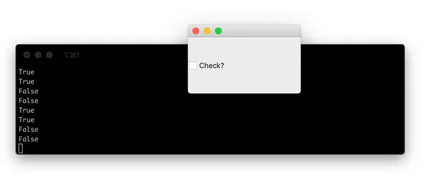
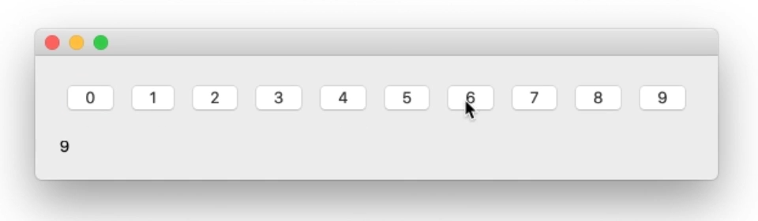
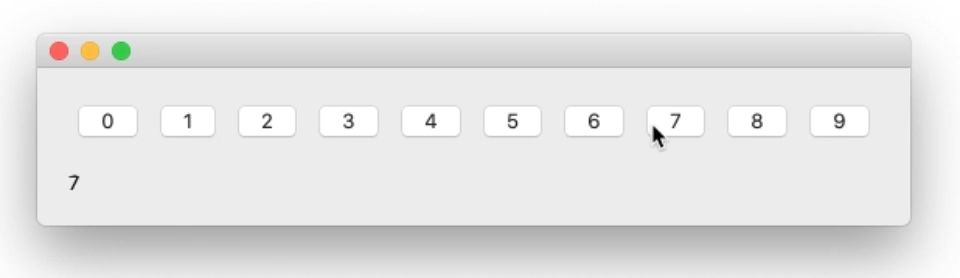

# 使用Qt信号传输额外数据修改小部件信号以将上下文信息传递到插槽

信号是Qt的一个简洁功能，它允许您在应用程序中的不同组件之间传递消息。信号连接到插槽，这些插槽是函数（或方法），每次信号触发时都会运行。许多信号还传输数据，提供有关状态变化或触发它们的小部件的信息。接收槽可以使用此数据执行不同的操作以响应相同的信号。

但是，有一个限制：信号只能发射其设计的数据。例如，a 有一个 `.triggered` 在激活该特定操作时触发的 a `QAction` 。触发的信号发出一条数据 -- 被触发后的动作的检查状态。

> 对于不可检查的操作，此值将始终为 `False`

接收函数不知道是哪个 `QAction` 触发了它，也不知道接收有关它的任何其他数据。

这通常没问题。您可以将特定操作绑定到唯一函数，该函数可以精确地执行该操作所需的操作。然而，有时你需要插槽功能来了解它所给予的更多 `QAction` 。这可能是触发信号的对象，也可能是您的插槽执行信号预期结果所需的其他一些相关元数据。

这是扩展或修改Qt提供的内置信号的有效方法。

## 拦截信号

您不是将信号直接连接到目标功能，而是使用中间功能来拦截信号，修改信号数据并将其转发到实际的时隙功能。

此插槽函数必须接受信号发送的值（此处为 `checked` 状态），然后调用实际插槽，将任何其他数据与参数一起传递。

```python
def fn(checked):
    self.handle_trigger(checked, <additional args>)
```

除了定义这个中间函数之外，您还可以使用 `lambda` 函数实现相同的目的。如上所述，它接受单个参数 `checked` ，然后调用实际插槽。

```python
lambda checked: self.handle_trigger(checked, <additional args>)
```

在这两个示例中，都可以 `<additional args>` 将其替换为您要转发到插槽的任何内容。在下面的示例中， `QAction` 我们将对象 `action` 转发到接收槽。

```python
action = QAction()
action.triggered.connect( lambda checked: self.handle_trigger(checked, action) )
```

我们的 `handle_trigger` slot 方法将接收原始 `checked` 值和 `QAction` 对象。或者接收插槽可能看起来像这样

```python
# a class method.
def handled_trigger(self, checked, action):
    # do something here.
```

以下是使用此方法修改 MainWindow.windowTitleChanged 随信号发送的数据的几个示例。

```python
from PyQt5.QtWidgets import (
    QApplication, QMainWindow
)
from PyQt5.QtCore import Qt

import sys


class MainWindow(QMainWindow):

    def __init__(self):
        super(MainWindow, self).__init__()

        # SIGNAL: The connected function will be called whenever the window
        # title is changed. The new title will be passed to the function.
        self.windowTitleChanged.connect(self.on_window_title_changed)

        # SIGNAL: The connected function will be called whenever the window
        # title is changed. The new title is discarded and the
        # function is called without parameters.
        self.windowTitleChanged.connect(lambda x: self.on_window_title_changed_no_params())

        # SIGNAL: The connected function will be called whenever the window
        # title is changed. The new title is discarded and the
        # function is called without parameters.
        # The function has default params.
        self.windowTitleChanged.connect(lambda x: self.my_custom_fn())

        # SIGNAL: The connected function will be called whenever the window
        # title is changed. The new title is passed to the function
        # and replaces the default parameter. Extra data is passed from
        # within the lambda.
        self.windowTitleChanged.connect(lambda x: self.my_custom_fn(x, 25))

        # This sets the window title which will trigger all the above signals
        # sending the new title to the attached functions or lambdas as the
        # first parameter.
        self.setWindowTitle("My Signals App")

    # SLOT: This accepts a string, e.g. the window title, and prints it
    def on_window_title_changed(self, s):
        print(s)

    # SLOT: This is called when the window title changes.
    def on_window_title_changed_no_params(self):
        print("Window title changed.")

    # SLOT: This has default parameters and can be called without a value
    def my_custom_fn(self, a="HELLLO!", b=5):
        print(a, b)


app = QApplication(sys.argv)
w = MainWindow()
w.show()
app.exec_()
```

块末尾的` .setWindowTitle `调用会更改窗口标题并触发信号，该 `.windowTitleChanged` 信号会以 `str . __init__` 我们附加了一系列中间插槽函数（作为 `lambda` 函数），这些函数修改了这个信号，然后用不同的参数调用了我们的自定义插槽。

运行此操作将生成以下输出。

```bash
My Signals App
Window title changed.
HELLLO! 5
My Signals App 5
My Signals App 25
```

中间函数可以简单或复杂，只要你喜欢 -- 除了丢弃/添加参数外，您还可以执行查找以将信号修改为不同的值。

在以下示例中，复选框表示 `Qt.Checked` 或 `Qt.Unchecked` 由中间插槽修改为值 `bool` 。

```python
from PyQt5.QtWidgets import (
    QApplication, QMainWindow, QCheckBox
)
from PyQt5.QtCore import Qt

import sys


class MainWindow(QMainWindow):

    def __init__(self):
        super(MainWindow, self).__init__()

        checkbox = QCheckBox("Check?")

        # Option 1: conversion function
        def checkstate_to_bool(state):
            if state == Qt.Checked:
                return self.result(True)

            return self.result(False)

        checkbox.stateChanged.connect(checkstate_to_bool)

        # Option 2: dictionary lookup
        _convert = {
            Qt.Checked: True,
            Qt.Unchecked: False
        }

        checkbox.stateChanged.connect(
            lambda v: self.result(_convert[v])
        )

        self.setCentralWidget(checkbox)

    # SLOT: Accepts the check value.
    def result(self, v):
        print(v)


app = QApplication(sys.argv)
w = MainWindow()
w.show()
app.exec_()
```

在此示例中，我们以两种方式将 `.stateChange` 信号连接到 `result` -- a） 使用中间函数调用带有信号参数 `True` 或依赖于信号 `False` 参数的方法 `.result` ，以及 b） 使用中间函数中的字典查找 `lambda` 。

每次更改状态时，运行此代码都会输出 或 `False` 输出 `True` 到命令行（每次连接到信号时一次）。



## 循环问题

想要以这种方式连接信号的最常见原因之一是当您构建一系列对象并在循环中以编程方式连接信号时。不幸的是，事情并不总是那么简单。

如果您尝试在循环访问变量时构造截获的信号，并希望将循环变量传递到接收槽，则会遇到问题。例如，在下面的代码中，我们创建一系列按钮，并使用中间函数将按钮值 （0-9） 与按下的信号一起传递。

```python
from PyQt5.QtWidgets import (
    QApplication, QMainWindow, QAction, QPushButton,
    QWidget, QLabel, QVBoxLayout, QHBoxLayout
)

import sys

class Window(QWidget):

    def __init__(self):
        super().__init__()

        v = QVBoxLayout()
        h = QHBoxLayout()

        for a in range(10):
            button = QPushButton(str(a))
            button.pressed.connect(
                lambda: self.button_pressed(a)
            )
            h.addWidget(button)

        v.addLayout(h)
        self.label = QLabel("")
        v.addWidget(self.label)
        self.setLayout(v)

    def button_pressed(self, n):
        self.label.setText(str(n))


app = QApplication(sys.argv)
w = Window()
w.show()
app.exec_()
```

如果你运行它，你会看到问题 - 无论你点击哪个按钮，你都会得到标签上显示的相同数字（9）。为什么是 9？它是循环的最后一个值。



问题是我们传递 `a` 到最后一个 `button_pressed` 插槽的线路 `lambda: self.button_pressed(a)` 。在此上下文中， `a` 绑定到循环。

```python
for a in range(10):
    # .. snip ...
    button.pressed.connect(
        lambda: self.button_pressed(a)
    )
    # .. snip ...
```

我们传递的不是创建按钮时的` a `值，而是信号触发时的任何值 `a` 。由于信号在循环完成后触发 -- 我们在创建UI后与UI进行交互 -- 每个信号的 `a` 值是循环中的最终值 `a` ：9。

因此，单击其中任何一个都会将 9 发送到 `button_pressed`

解决方案是将值作为（重新）命名的参数传入。这会将参数绑定到循环中该点的 `a` 值，从而创建一个新的、未连接的变量。循环继续，但绑定变量不会改变。

这样可以确保在调用时获得正确的值。

```python
lambda val=a: self.button_pressed(val)
```

您不必重命名变量，也可以选择对绑定值使用相同的名称。

```python
lambda a=a: self.button_pressed(a)
```

重要的是使用命名参数。把它放到一个循环中，它看起来像这样：

```python
for a in range(10):
    button = QPushButton(str(a))
    button.pressed.connect(
        lambda val=a: self.button_pressed(val)
    )
```

现在运行它，您将看到预期的行为 - 标签更新为与按下的按钮匹配的数字。



工作规范如下：

```python
from PyQt5.QtWidgets import (
    QApplication, QMainWindow, QAction, QPushButton,
    QWidget, QLabel, QVBoxLayout, QHBoxLayout
)

import sys


class Window(QWidget):

    def __init__(self):
        super().__init__()

        v = QVBoxLayout()
        h = QHBoxLayout()

        for a in range(10):
            button = QPushButton(str(a))
            button.pressed.connect(
                lambda val=a: self.button_pressed(val)
            )
            h.addWidget(button)

        v.addLayout(h)
        self.label = QLabel("")
        v.addWidget(self.label)
        self.setLayout(v)

    def button_pressed(self, n):
        self.label.setText(str(n))


app = QApplication(sys.argv)
w = Window()
w.show()
app.exec_()
```
