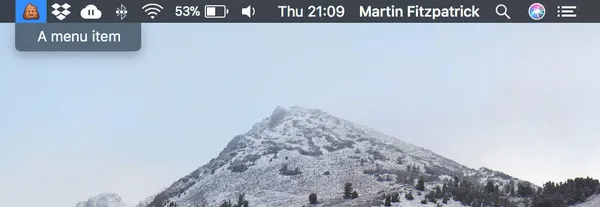
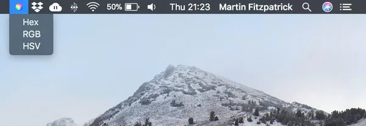
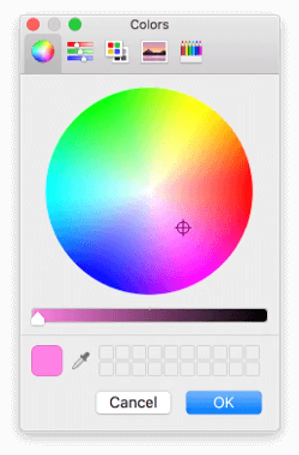

# 系统托盘和Mac菜单栏应用程序

系统托盘应用程序（或菜单栏应用程序）可用于在少量点击中提供常用功能或信息。对于完整的桌面应用程序，它们是在不打开整个窗口的情况下控制应用程序的有用快捷方式。

Qt提供了一个简单的界面，用于构建跨平台的系统托盘（Windows）或菜单栏（MacOS）应用程序。

## 最小示例

下面是一个最小的工作示例，用于在工具栏/系统托盘中显示带有菜单的图标。菜单中的操作未连接，因此尚未执行任何操作。

```python
from PyQt5.QtGui import *
from PyQt5.QtWidgets import *

app = QApplication([])
app.setQuitOnLastWindowClosed(False)

# Create the icon
icon = QIcon("icon.png")

# Create the tray
tray = QSystemTrayIcon()
tray.setIcon(icon)
tray.setVisible(True)

# Create the menu
menu = QMenu()
action = QAction("A menu item")
menu.addAction(action)

# Add a Quit option to the menu.
quit = QAction("Quit")
quit.triggered.connect(app.quit)
menu.addAction(quit)

# Add the menu to the tray
tray.setContextMenu(menu)

app.exec_()
```

您会注意到没有 `QMainWindow` ，仅仅是因为我们实际上没有任何窗口可以显示。您可以像往常一样创建窗口，而不会影响系统托盘图标的行为。

> 在这个例子中，你需要一个图标——我推荐赋格图标集。
<!--split-->
> Qt中的默认行为是在所有活动窗口关闭后关闭应用程序。这不会影响这个玩具示例，但在应用程序中，您确实会创建窗口然后关闭它们。设置“app.setQuitOnLastWindowClosed（False）”将停止此操作，并确保应用程序继续运行。

提供的图标显示在工具栏中（您可以在左侧看到它）。


单击图标可显示添加的菜单。



此应用程序尚未执行任何操作，因此在下一部分中，我们将扩展此示例以创建一个迷你颜色选择器。

## 彩色托盘

下面是一个更完整的工作示例，使用内置 `QColorDialog` 的 from Qt 为工具栏提供可访问的颜色选择器。该菜单允许您选择以 HTML 格式 `#RRGGBB rgb(R,G,B)`或 `hsv(H,S,V)` .

```python
from PyQt5.QtGui import *
from PyQt5.QtWidgets import *

app = QApplication([])
app.setQuitOnLastWindowClosed(False)

# Create the icon
icon = QIcon("color.png")

clipboard = QApplication.clipboard()
dialog = QColorDialog()

def copy_color_hex():
    if dialog.exec_():
        color = dialog.currentColor()
        clipboard.setText(color.name())

def copy_color_rgb():
    if dialog.exec_():
        color = dialog.currentColor()
        clipboard.setText("rgb(%d, %d, %d)" % (
            color.red(), color.green(), color.blue()
        ))

def copy_color_hsv():
    if dialog.exec_():
        color = dialog.currentColor()
        clipboard.setText("hsv(%d, %d, %d)" % (
            color.hue(), color.saturation(), color.value()
        ))

# Create the tray
tray = QSystemTrayIcon()
tray.setIcon(icon)
tray.setVisible(True)

# Create the menu
menu = QMenu()
action1 = QAction("Hex")
action1.triggered.connect(copy_color_hex)
menu.addAction(action1)

action2 = QAction("RGB")
action2.triggered.connect(copy_color_rgb)
menu.addAction(action2)

action3 = QAction("HSV")
action3.triggered.connect(copy_color_hsv)
menu.addAction(action3)

quit = QAction("Quit")
quit.triggered.connect(app.quit)
menu.addAction(quit)

# Add the menu to the tray
tray.setContextMenu(menu)

app.exec_()
```

与前面的示例一样，此示例没有 `QMainWindow` 。菜单和以前一样创建，但为不同的输出格式添加了 3 个操作。每个操作都连接到它所表示的格式的特定处理程序函数。每个处理程序都显示一个对话框，如果选择了某种颜色，则会以给定格式将该颜色复制到剪贴板。

和以前一样，该图标将显示在工具栏中。


单击该图标会显示一个菜单，您可以从中选择要返回的图像格式。



选择格式后，您将看到标准的Qt颜色选择器窗口。



选择所需的颜色，然后单击确定。所选颜色将以请求的格式复制到剪贴板。可用的格式将产生以下输出：

```python
#a2b3cc             # range 00-FF
rgb(25, 28, 29)     # range 0-255
hsv(14, 93, 199)    # range 0-255
```

## 改进建议

一个简单而不错的改进是使以前选择的颜色可以以其他格式重新复制。您可以通过存储现有菜单中的颜色结果值来执行此操作。然后再添加 3 个选项，这些选项（在菜单上）显示它们的返回值——单击这些选项只是将该值复制到剪贴板。
