# 使用Qt Designer的第一步

## 使用 Qt Designer 的拖放界面来设计 PyQt5 GUI

到目前为止，我们一直在使用 Python 代码创建应用程序。这在许多情况下都很有效，但随着应用程序变得越来越大或者界面变得越来越复杂，以编程方式定义所有小部件可能会变得有点麻烦。好消息是 Qt 附带了一个图形编辑器 - Qt Designer - 其中包含一个拖放式 UI 编辑器。使用 Qt Designer，您可以直观地定义 UI，然后只需连接应用程序逻辑即可。

在本教程中，我们将介绍使用 Qt Designer 创建 UI 的基础知识。原理、布局和小部件是相同的，因此您可以应用您已经学到的所有内容。您还需要了解 Python API 以便稍后连接您的应用程序逻辑。

> 本教程需要安装 Qt Creator — 您可以从 Qt 网站免费下载它。前往<https://www.qt.io/download> 并下载Qt包。您可以选择在安装过程中仅安装 Creator。

打开 Qt Creator，您将看到主窗口。可通过左侧的选项卡使用设计器。但是，要激活此功能，您首先需要开始创建 .ui 文件。

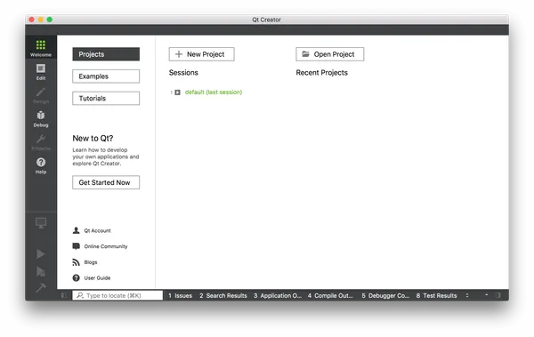

要创建 .ui 文件，请转到文件 -> 新文件或项目... 在出现的窗口中，选择左侧文件和类下的 Qt，然后选择右侧的 Qt Designer Form。您会注意到该图标上有“ui”，显示您正在创建的文件类型。

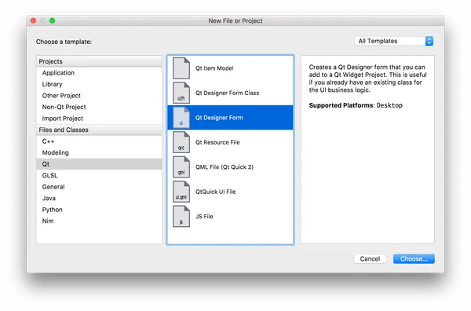

在下一步中，系统将询问您要创建什么类型的小部件。如果您要启动应用程序，那么主窗口是正确的选择。但是，您也可以为对话框、表单和自定义复合小部件创建 .ui 文件。

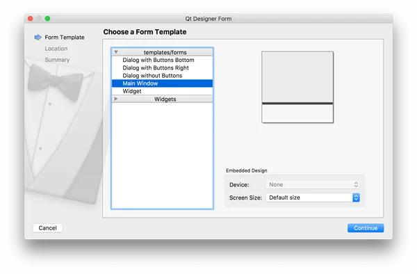

接下来选择文件名并保存文件的文件夹。使用与要创建的类相同的名称保存 .ui 文件，只是为了使后续命令更简单。

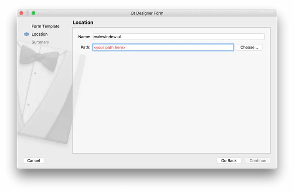

最后，如果您正在使用版本控制系统，您可以选择将该文件添加到版本控制系统中。请随意跳过此步骤 - 它不会影响您的用户界面。

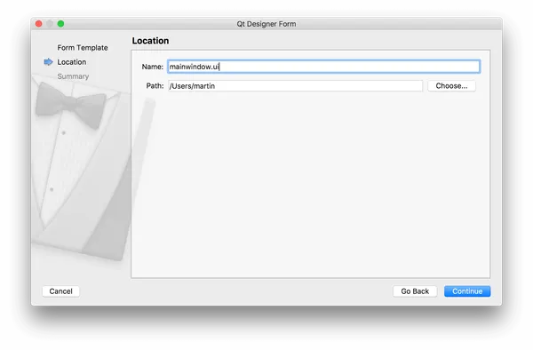

## 布置主窗口

您将在 UI 设计器中看到新创建的主窗口。一开始没有什么可看的，只有一个代表窗口的灰色工作区域，以及窗口菜单栏的开头。

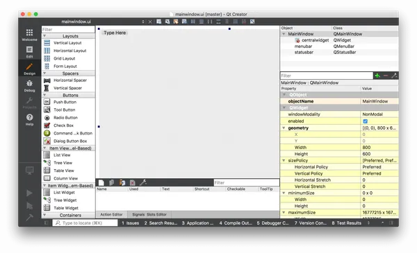

您可以通过单击窗口并拖动每个角上的蓝色手柄来调整窗口大小。

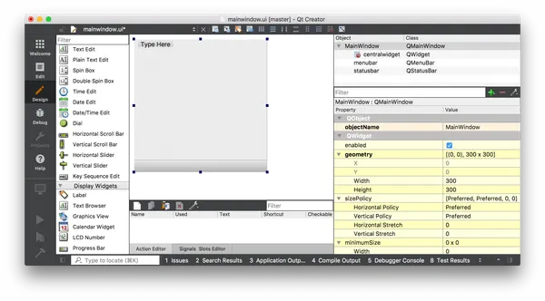

构建应用程序的第一步是向窗口添加一些小部件。在我们的第一个应用程序中，我们了解到要为 QMainWindow 设置中央小部件，我们需要使用 .setCentralWidget() 。我们还看到，要添加具有布局的多个小部件，我们需要一个中介 QWidget 来应用布局，而不是直接将布局添加到窗口。

Qt Creator 会自动为您处理这个问题，尽管这不是特别明显。

要使用布局将多个小部件添加到主窗口，请首先将小部件拖到 QMainWindow 上。这里我们拖动 3 个标签。将它们放在哪里并不重要。

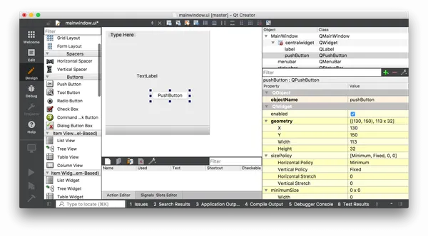

我们通过将 2 个小部件拖到窗口上来创建它们，使它们成为该窗口的子窗口。我们现在可以应用布局。

在右侧面板中找到 QMainWindow （它应该位于顶部）。在下面您可以看到centralwidget 代表窗口的中央小部件。中央小部件的图标显示当前应用的布局。最初它有一个红色十字交叉，表明没有活动的布局。

右键单击 QMainWindow 对象，然后在出现的下拉列表中找到“布局”。

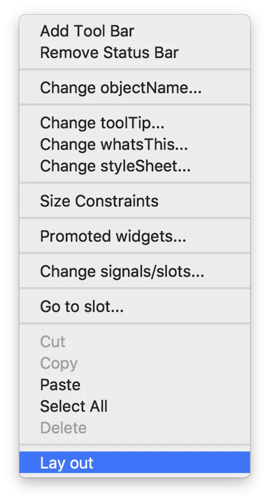

接下来，您将看到可应用于窗口的布局列表。选择水平布局，布局将应用于小部件。

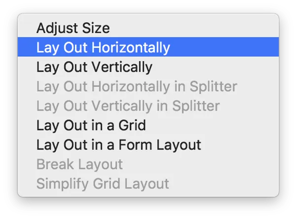

所选布局将应用于 QMainWindow 的centralwidget，并且小部件将添加到布局中，并根据所选布局进行布局。请注意，在 Qt Creator 中，您实际上可以在布局中拖动和重新排序小部件，或者根据需要选择不同的布局。这使得原型设计和尝试变得特别好。

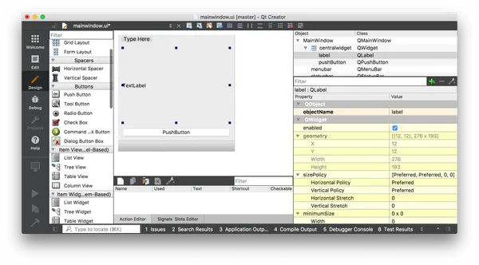

## 使用生成的 .ui 文件

我们创建了一个非常简单的用户界面。下一步是将其放入 Python 中并使用它构建一个工作应用程序。

首先保存您的 .ui 文件 - 默认情况下，它将保存在您创建文件时选择的位置，尽管您可以根据需要选择其他位置。

.ui 文件采用 XML 格式。要使用 Python 中的 UI，我们有两种可用的替代方法 -

1. 使用 .loadUI() 方法加载到类中
2. 使用 pyuic5 工具将其转换为 Python。

下面介绍这两种方法。就我个人而言，我更喜欢将 UI 转换为 Python 文件，以便从编程和打包的角度保持相似。

### 直接加载.ui文件

要加载 .ui 文件，我们可以使用 PyQt5 中包含的 uic 模块，特别是 uic.loadUI() 方法。这获取 UI 文件的文件名并加载它，创建一个功能齐全的 PyQt5 对象。

```PYTHON
import sys
from PyQt5 import QtWidgets, uic

app = QtWidgets.QApplication(sys.argv)

window = uic.loadUi("mainwindow.ui")
window.show()
app.exec()
```

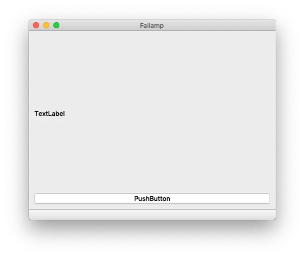

> 由于 uid.loadUI() 方法转换为实例对象，因此您无法附加自定义 `__init__()` 代码。但是，您可以通过自定义设置函数来处理此问题

要从现有小部件的 `__init__` 块（例如 QMainWindow ）加载 UI，您可以使用 PyQt5 的 uic.loadUI(filename, self) 。

```PYTHON
import sys
from PyQt5 import QtCore, QtGui, QtWidgets
from PyQt5 import uic


class MainWindow(QtWidgets.QMainWindow):

    def __init__(self, *args, **kwargs):
        super().__init__(*args, **kwargs)
        uic.loadUi("mainwindow.ui", self)


app = QtWidgets.QApplication(sys.argv)
window = MainWindow()
window.show()
app.exec_()
```

### 将 .ui 文件转换为 Python

要生成 Python 输出文件，请从命令行运行 pyuic5 ，并使用 -o 参数传递 .ui 文件和输出目标文件。下面将生成一个名为 MainWindow.py 的 Python 文件，其中包含我们创建的 UI。

```bash
pyuic5 mainwindow.ui -o MainWindow.py
```

如果您使用 PyQt4，该工具名为“pyuic4”，但在其他方面完全相同。

您可以在编辑器中打开生成的 MainWindow.py 文件进行查看，但您不应编辑此文件。使用 Qt Creator 的强大之处在于能够在开发时编辑、调整和更新您的应用程序。更新此文件时，对此文件所做的任何更改都将丢失。但是，当您在应用程序中导入和使用该文件时，您可以覆盖和调整任何您喜欢的内容。

导入生成的 Python 文件与任何其他文件一样。您可以按如下方式导入您的课程。 pyuic5 工具将 Ui_ 附加到 Qt Creator 中定义的对象名称，这就是您要导入的对象。

```PYTHON
from MainWindow import Ui_MainWindow
```

要在应用程序中创建主窗口，请像平常一样创建一个类，但从 QMainWindow 和导入的 Ui_MainWindow 类创建子类。最后，从 `__init__` 内部调用 self.setupUi(self) 来触发接口的设置。

```PYTHON
import sys
from PyQt5 import QtWidgets, uic

from MainWindow import Ui_MainWindow


class MainWindow(QtWidgets.QMainWindow, Ui_MainWindow):
    def __init__(self, *args, obj=None, **kwargs):
        super(MainWindow, self).__init__(*args, **kwargs)
        self.setupUi(self)


app = QtWidgets.QApplication(sys.argv)

window = MainWindow()
window.show()
app.exec()
```

这会产生与之前完全相同的结果。


就是这样。您的窗口现已完全设置完毕。由于使用 .ui 文件会抽象出特定于 UI 的代码，因此您可以使用相同的模式来加载您设计的任何界面。
